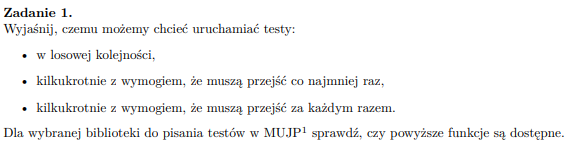

## 

### w losowej kolejności

możemy testować niezwiązane ze sobą metody, kolejność wykonania testów w tym przypadku nie powinna mieć znaczenia 
przykład: testy jednostkowe

### kilkukrotnie z wymogiem, że muszą przejść co najmniej raz

testy obejmują zachowania losowe lub niedeterministyczne programu, wtedy nie zawsze możemy uzyskać pozywtywne przejście testu za pierwszym razem

### kilkukrotnie z wymogiem, że muszą przejść za każdym razem.

- testujemy produkt, który ma iść na produkcje

- sprawdzamy czy nasze testy nie są 'niestabilne' zależne od wątków, timeoutów, zależności czasowych, losowości i wtedy mogą dać inny wynik -> bo to oznacza, że nasz program też może być niestabilny