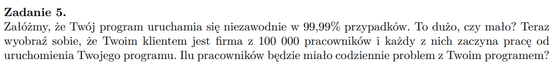
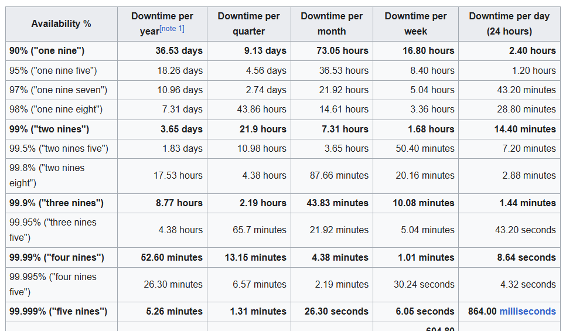

## 

### dużo czy mało?
zależy od ilości wywołań, "ważności" oprogramowania -> jakie starty przynosi zawodne uruchomienie

### ilu pracowników z problemem?

0.9999 * 100000 => 10

better -> "five nines"

https://en.wikipedia.org/wiki/High_availability

czyli :
$$ \frac{52.6 - 5.26}{52.6} \times 100\% \approx 90\% $$

fivenines jest 90% lepszy pod wzgledem dostepnosci niż fournines
możemy zauwazyc, ze kazda kolejna dziesiątka około dziesięciokrotnie zmniejsza czas niedostępności. (zaczynajac od 99,9)