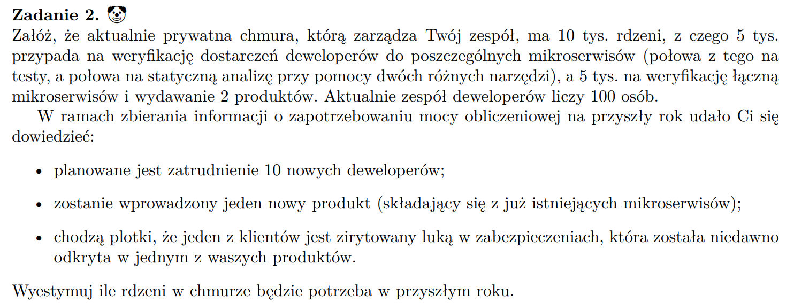

## 

- Ile maszyn wirtualnych potrzeba a tam ile prockow ile ramu i ile dysków.
- jakie bylo szczytowe ociazenie/ czy istnieja trendy w obciazeniu (wieksze w nocy/ pod koniec miesiaca)
- planowane migracje/ integracje/ modernizacje systemow
- polityka skalowania chmruy
- czy w nadchodzącym roku planowane są nowe projekty lub aplikacje, które zwiększą zużycie zasobów
- Czy istnieją limity dotyczące maksymalnego zużycia zasobów/ koszty