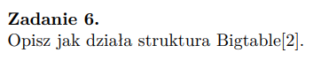

## liczba zgłoszonych błędów (minimalizacja):
- wieksze pokrcie kodu testami
- wlaczenie testow do CI/CD
- lepsze komentarze do funkcji/ do dawanych programisto zadań by kod był czytelniejszy

## liczba zgłoszonych elementów potencjalnie zagrażających BHP (maksymalizacja):
- zwiększenie częstości szkoleń BHP dla pracowników
- stworzenie instrukcji BHP dla stanowisk / wnętrz w biurze

## stosunek godzin poświęconych na implementację danej funkcjonalności, względem początkowej estymaty (optymalizacja w kierunku 1.0)
- dokładne planowanie sprintów (agile)
- lepsze opisy zadań
- estymaty ustalane przez zespół w rodze dyskusji (odpowiednio uzasadnione)
  
## stosunek wstępnej estymaty czasu potrzebnego na implementację do czasu z estymaty pogłębionej (optymalizacja w kierunku 1.0)
- okreslenie kryteriow akceptacji i wykonania zadan
- okreslenie zaleznosci miedzy zadaniami