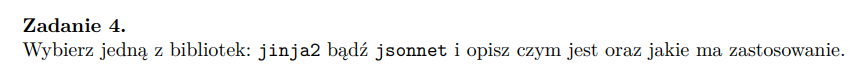

## 

### Jinja2 
to silnik szablonów dla języka programowania Python pozwalający na separację logiki aplikacji od jej warstwy prezentacyjnej. Oprogramowanie o otwartym kodzie źródłowym, udostępnianym na zasadach licencji BSD.

Używa składni podobnej do Django:

{{ ... }} do wstawiania wartości zmiennych,

 do sterowania logiką (if, for, itp.),

{# ... #} do komentarzy.

Zastosowania:
Frameworki webowe -> Głównie w Flasku (domyślny silnik szablonów).

Generowanie stron HTML -> Oddzielenie logiki backendu od widoków.

Raporty i dokumenty -> Generowanie PDF, LaTeX, e-maili czy plików CSV na podstawie szablonów.
