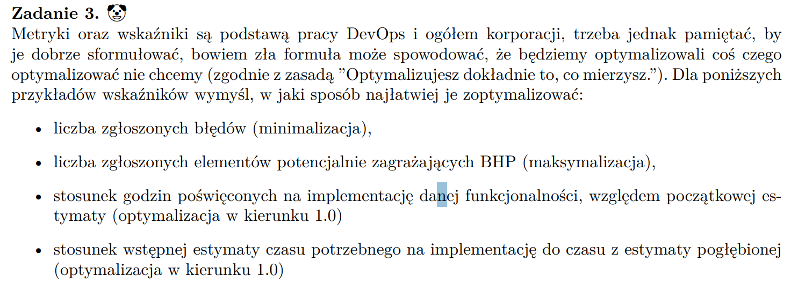

## 

Bigtable to rozproszona, kolumnowa, wersjonowana baza typu klucz–wartość, której podstawą jest model row key + column family + timestamp. Fizycznie składa się z tabletów przechowywanych w strukturach SSTable i MemTable, zarządzanych przez tablet serwery i mastera.

