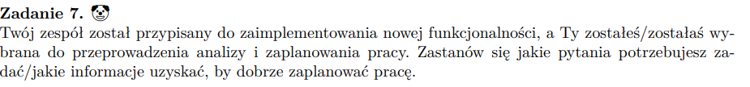

## 

- czego ta funkcjonalność ma dotyczyć
- kto jest jej uzytkownikiem
- czy podobna funkcjonalność już istnieje w systemie i może wymaga tylko rozszerzenia
- ile czasu pracy ona zaoszczędza, że ją wprowadzamy / jaki jest jej cel, jak wysoko jest na liscie priorytetow dodawanych funkcjonalnosci
- jaki mamy budżet na jej wprowadzenie -> ile roboczogodzin mamy do wykorzystania by nadal to było dla nas opłacalne i ile może nam zapłacić za tę funkcjonalność klient
- jakie narzędzia będą potrzebne do wprowadzenia tej funkcjonalności
- ile zajmuje ich konfiguracja
- czy wymagane są zmiany w obecnie używanych technologiach w celu konfiguracji z nowymi, potrzebnymi do dodania tej funkcjonalności
- czy bedziemy operowac na jakichs danych wrazliwych -> jak sobie bedziemy z nimi radzic
- czy klient chce na bieżąco obserwować efekty tworzenia funkcjonalności -> by wprowdzać ewentualne zmiany czy dopiero efek końcowy?
- jak bedzie wygladala komunikacja z klientem (spotkania, w jakich odstepach czasu online/ stacjonarnie)
- jak będziemy mierzyć, że funkcjonalność działa poprawnie (np. akceptacja szybkości czasu działania)