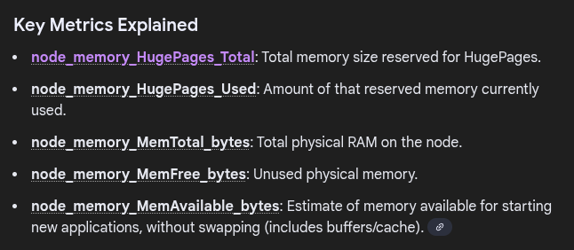
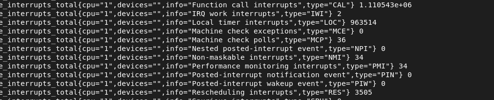
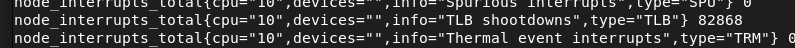

aby uruchomic prometheus na porcie 9090, nalezy wykonac nastepujace kroki:

```
sudo systemctl start prometheus
sudo systemctl status prometheus
localhost:9090
sudo systemctl enable --now prometheus-node-exporter
```

## Skonfiguruj Prometeusza do odczytu danych systemowych z prometheus-node-exporter, a następnie:
### a) Zdefiniuj reguły PromQL, wyliczające średnie procentowe obciążenie procesora w oknie 1min i 5min.
https://prometheus.io/docs/guides/node-exporter/#exploring-node-exporter-metrics-through-the-prometheus-expression-browser

https://stackoverflow.com/questions/66169803/cpu-usage-for-each-node-in-prometheus

średnie procentowe obciążenie procesora w oknie 1min w PromQL:
```avg(rate(node_cpu_seconds_total{mode!="idle"}[1m])) by (instance) * 100```
średnie procentowe obciążenie procesora w oknie 5min w PromQL:
```avg(rate(node_cpu_seconds_total{mode!="idle"}[5m])) by (instance) * 100```

### b) Zdefiniuj reguły PromQL, wyliczające procentową zajętość pamięci RAM, przestrzeni swap oraz procent pamięci zajętej przez HugePages w stosunku do całej zajętej pamięci RAM.

https://signoz.io/guides/average-memory-usage-query-prometheus/



procentowa zajętość pamięci RAM w PromQL:
```(node_memory_MemTotal_bytes - node_memory_MemAvailable_bytes) / node_memory_MemTotal_bytes * 100```
procentowa zajętość przestrzeni swap w PromQL:
```(node_memory_SwapTotal_bytes - node_memory_SwapFree_bytes) / node_memory_SwapTotal_bytes * 100```
procent pamięci zajętej przez HugePages w stosunku do całej zajętej pamięci RAM w PromQL:
```(node_memory_HugePages_Total / node_memory_MemTotal_bytes) * 100```

### c) Pokaż jak powyższe reguły obliczać gorliwie przy pomocy recording rules.
cd /etc/prometheus
musimy utworzyc plik prometheus_rules.yml:
sudo nano prometheus_rules.yml

teraz musimy zmodyfikowac plik konfiguracyjny prometheusa /etc/prometheus/prometheus.yml i dodac do niego linijke:

```rule_files:
  - "prometheus_rules.yml"
```
### d) Zdefiniuj pojedynczą1 regułę PromQL wyświetlającą stosunek przerwań LOC, RES, CAL, TLB obsłużonych przez dany rdzeń do procentowego obciążenia danego rdzenia.
do pliku sudo nano /etc/default/prometheus-node-exporter
trzeba dodac:
```
ARGS="--collector.cpu --collector.meminfo --collector.diskstats --collector.interrupts"

```
nastepnie:
```
sudo systemctl restart prometheus-node-exporter
curl http://localhost:9100/metrics | grep node_interrupts_total
```


