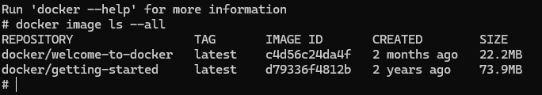

## planowane jest zatrudnienie 10 nowych deweloperów;

Skoro 5 tys rdzeni jest wykorzystywanych przez 100 developerow na testy i statystyczna analize, to gdy liczba developerow wzroscie o 10 -> czyli o 10 %, bedziemy potrzebować okolo 10% wiecej rdzeni czyli:
5000 * 1,1 = 5500 rdzeni

## zostanie wprowadzony jeden nowy produkt (składający się z już istniejących mikroserwisów);

Skoro obecnie 5000 rdzeni jest przeznaczonych na  weryfikację łączną
mikroserwisów i wydawanie 2 produktów (czyli około 2500 rdzeni na produkt), to gdy dojdzie nam jeszcze jeden produkt:
5000 * 3 /2 => 7500 rdzeni

## chodzą plotki, że jeden z klientów jest zirytowany luką w zabezpieczeniach, która została niedawno odkryta w jednym z waszych produktów.

irytacje zabezpieczeniami spowoduje wzorst na weryfikacji łącznej mikroserwisówo około 10-20%

Po uwzglednieniu wprowadzenia nowego produktu mamy:
7500 * 1,1 (przy zalozeniu ze wzrosnie o 10%) => 8250
7500 * 1,2 (przy zalozeniu pesymistycznym wzrostu o  20%) => 9000

Zatem łącznie:
8250 + 5500 = 13750 rdzeni
9000 + 5500 = 14500 rdzeni

Mozna wiec zaem powiedzieć, że bedzie potrzeba od 14k-15k rdzeni lacznie.