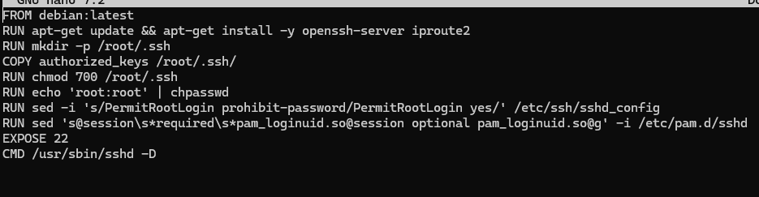

docker build -t ssh-server .

docker run -d -p 2222:22 --name ssh-container ssh-server

w drugim oknie: 

ssh root@LAPTOP-KS5QVHTA -p 2222

## Tryb interaktywny:

docker run -it ssh-server bash

## Następnie uruchom docker w trybie interaktywnym i pokaż, że jesteś w stanie używać basha wewnątrz dockera. Wyjdź z kontenera. Co się z nim stało? Czy został usunięty?
Po wyjściu z kontenera w trybie interaktywnym kontener zostaje zatrzymany, ale nie usunięty. Można go ponownie uruchomić lub usunąć ręcznie.

## Co pokazuje docker ps? 
Pokazuje liste obecnie uruchomionych kontenerow.

## A docker ps --all? (-a tez dziala)

tyle, że mi -a pokazuje mi wszytskie,a -all tylko jeden-dwa.

Pokazuje wszystkie kontenery, w tym zatrzymane.

RUN chmod 700 /root/.ssh - ustawia uprawnienia katalogu .ssh tak, aby tylko użytkownik root miał do niego dostęp

RUN mkdir -p /root/.ssh - tworzy katalog .ssh w katalogu domowym użytkownika root, -p powoduje, że jeśli katalogi nadrzędne nie istnieją, to zostaną utworzone, a jak katalog już istnieje, to nie zostanie zgłoszony błąd.

RUN sed 's@session\s*required\s*pam_loginuid.so@session optional pam_loginuid.so@g' -i /etc/pam.d/sshd - modyfikuje plik konfiguracyjny PAM dla SSHD, zmieniając linię dotyczącą pam_loginuid.so z "required" na "optional". To może być potrzebne, aby uniknąć problemów z logowaniem użytkowników w niektórych środowiskach kontenerowych.