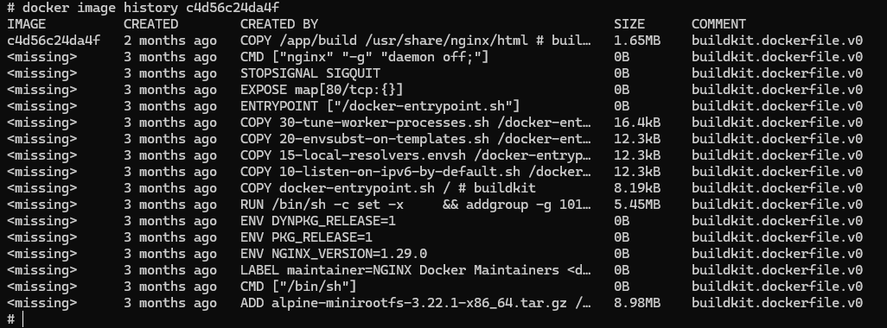
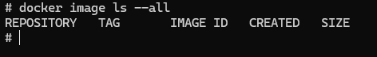

'Wyobraź sobie psotną małpę siejącą spustoszenie w Twojej serwerowni, fizycznie uszkadzając systemy i zrywając kable. Symulowanie nieoczekiwanych awarii naraża inżynierów na ryzyko utraty serwerów i motywuje ich do budowania odpornych usług, które poradzą sobie z takimi zakłóceniami.'

Chaos Monkey to narzędzie do testowania odporności systemów IT, które celowo wyłącza losowe serwery w sieci produkcyjnej, aby sprawdzić, jak systemy reagują na awarie. Wprowadzone przez Netflix, jego celem jest symulowanie rzeczywistych scenariuszy awarii, aby zbudować odporność całej infrastruktury, co sprawia, że pojedyncze awarie nie stanowią zagrożenia dla jej działania. 

Zalety Chaos Monkey

Korzyści z zastosowania tej funkcjonalności jest jednak znacznie więcej. Dotyczą one zarówno developmentu, jak i utrzymania systemów informatycznych i są to m.in.:

· budowa architektury aplikacji pozbawionych pojedynczych punktów awarii,
· uniemożliwianie lokalnego przechowywanie danych, przez co wymuszane jest przechowywanie danych w systemach bazodanowych relacyjnych lub no_sql,
· budowa centralnego systemu logów systemów operacyjnych i aplikacji, jakże cennego dla późniejszego monitoringu i przetwarzania danych Big Data,
· automatyczne odświeżanie zasobów serwerów wirtualnych,
· brak konieczności zarządzania pojedynczymi hostami, zespół IT zarządza obrazami systemów operacyjnych, a nie samymi hostami,
· automatyczne skalowanie infrastruktury i oszczędności energii, zabijana maszyna wirtualna w sytuacji niskiego obciążenia całego systemu nie wymaga provisioningu nowej na jej miejsce.

