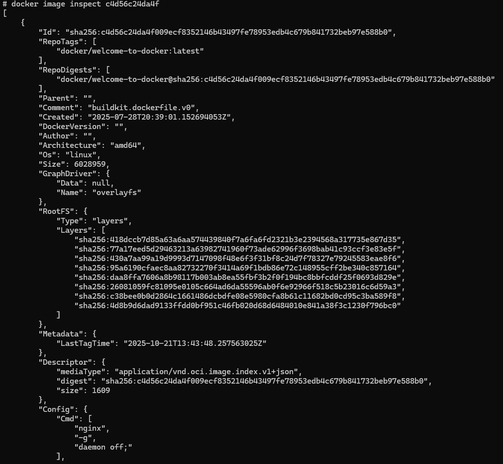

Change Management to trzyetapowy proces zmiany organizacyjnej: odmrożenie, zmiana i ponowne zamrożenie. Zapewnia ona ustrukturyzowany sposób zrozumienia, w jaki sposób organizacje przechodzą od stanu obecnego do pożądanego stanu przyszłego.

Lewin wyroznia:
Siły przyspieszające – Siły wymuszające zmiany
Siły opóźniające – Siły przeciwstawiające się zmianom 

Etap 1 - odmrozenie 
Chodzi o uświadomienie wszystkim, dlaczego stary sposób działania (status quo) jest nie do utrzymania i dlaczego zmiana jest konieczna.

Etap 2 - zmiana
Etap właściwej implementacji. teraz potrzeba jasnego kierunku i wsparcia, aby poruszać się w "nowej rzeczywistości". To moment największego chaosu i niepewności. 

Etap 3 - zamrozenie 
Celem tego etapu jest stabilizacja i utrwalenie nowego stanu jako "nowego normalnego". Bez tego zespoły mogą wrócić do starych nawyków, a zmiana nie zostanie w pełni zaakceptowana

