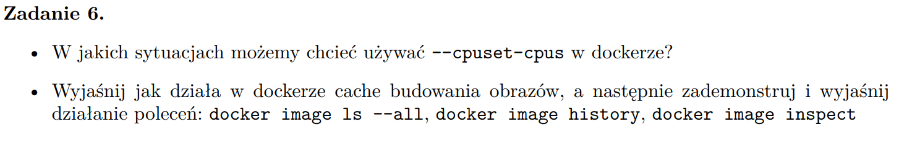
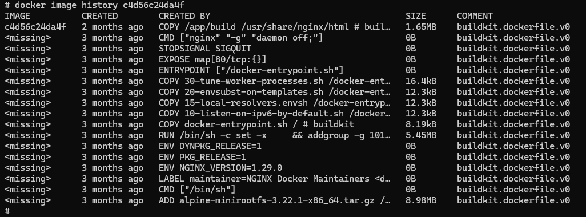
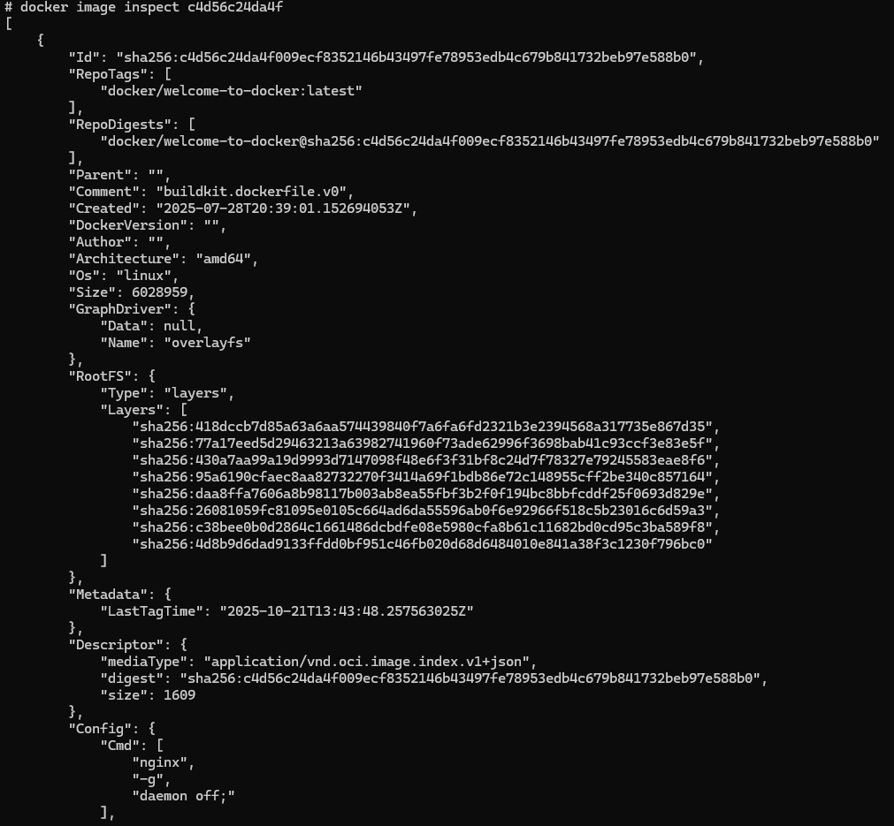
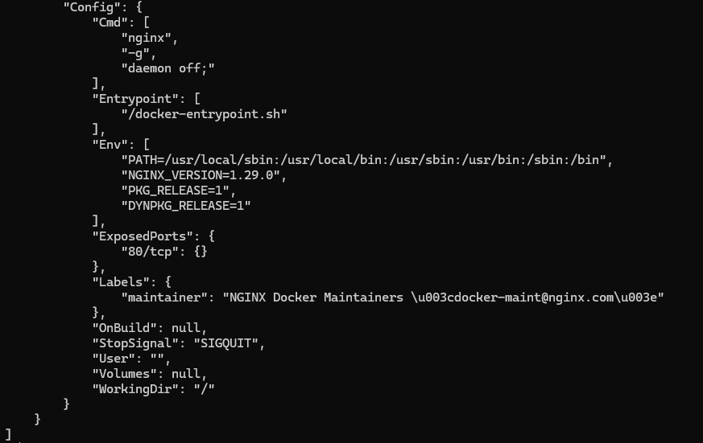

## --cpuset-cpus

Flaga --cpuset-cpus pozwala ograniczyć kontenerowi dostęp do konkretnych rdzeni procesora (CPU cores).
Używamy jej przy uruchamianiu kontenera

```
docker run --cpuset-cpus="0,1" ubuntu sleep 1000
```
Powyższa komenda uruchomi kontener, który będzie mógł korzystać tylko z rdzeni CPU o numerach 0 i 1. 

Po co chcemy tak robić?
- Izolacja zasobów - chcemy by kontener nie wpływał na prace innych procesów na maszynie.
- Testy wydajności - chcemy sprawdzić jak aplikacja działa przy ograniczonych zasobach CPU.

## Wyjaśnij jak działa w dockerze cache budowania obrazów

Docker budując obraz wykonuje kolejne kroki (layers) z pliku Dockerfile.
Każda instrukcja (FROM, RUN, COPY, ADD, ENV itd.) tworzy warstwę.
Jeśli dana warstwa się nie zmieniła, Docker może ją ponownie użyć z cache, co znacznie przyspiesza budowę obrazu.

```# Przykład Dockerfile
FROM ubuntu:22.04
RUN apt-get update && apt-get install -y python3
COPY . /app
RUN python3 /app/setup.py install
```
Jeśli zmienimy tylko plik w katalogu /app, Docker ponownie użyje warstw z instrukcjami FROM i RUN, a zbuduje na nowo tylko warstwę z COPY i kolejną RUN. Dzięki temu oszczędzamy czas i zasoby.

Cache nie jest używany tylko wtedy, gdy dodamy flagę `--no-cache` podczas budowania obrazu:

```bash
docker build --no-cache -t myimage:latest .
```

## docker image ls --all

Komenda `docker image ls --all` wyświetla listę wszystkich obrazów Docker dostępnych lokalnie na hoście, w tym również tych, które są oznaczone jako "dangling" (czyli nie mają tagu). Pokazuje takie informacje jak:


## docker image history <image>
Komenda `docker image history <image>` wyświetla historię warstw (layers) danego obrazu Docker. Pokazuje szczegóły dotyczące każdej warstwy, takie jak:



## docker image inspect <image>

Komenda `docker image inspect <image>` zwraca szczegółowe informacje o obrazie Docker w formacie JSON. Zawiera dane takie jak:

