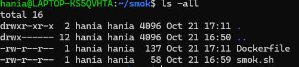

SLO = Service Level Objective

Docelowy poziom świadczenia usług (SLO) to wewnętrzny cel, który wyznaczasz, aby się upewnić, że świadczone usługi spełniają oczekiwania klientów. Oczekiwania te są przedstawione w umowach o poziomie świadczonych usług (SLA) zawartych między Tobą a klientem. Definiuje się je na podstawie SLI.

SLI -> wskaznik poziomu uslugi (zadania Http przechodza pomyslnie na 99.2%)
SLO -> Cel dla metryki SLI (celujemy by 99,5% zadan http przechodzilo pomyslnie)

Przykład:
Świadczysz usługę przesyłania strumieniowego wideo
Co oznacza 99,9% czasu sprawnosci w umowie SLO?
Usługa przesyłania strumieniowego może nie działać tylko przez około 43,2 minuty miesięcznie.

SLO -> wskaźnik, cel i ramy czasowe. 
- Wskaźnik jest mierzalną liczbą, taką jak czas przestoju lub opóźnienie
- celem jest konkretna liczba, którą próbujesz osiągnąć, na przykład 99,9% czasu dostępności. 
- Ramy czasowe wskazują, ile czasu, od miesiąca do roku, zajmuje pomiar wskaźnika.

Czemu nie 100%?
Bo jest to nierealne.
Budżety błędów są kluczowe w SLO, ponieważ nie można skupiać się wyłącznie na zapewnianiu ciągłej dostępności usługi. Chociaż czas dostępności jest istotny, trzeba znaleźć też czas na wprowadzanie innowacji i aktualizacji do swojego produktu. Twój budżet błędów mówi Ci, ile masz miejsca na błędy, dzięki czemu wiesz, w jakim stopniu możesz eksperymentować i wprowadzać innowacje.