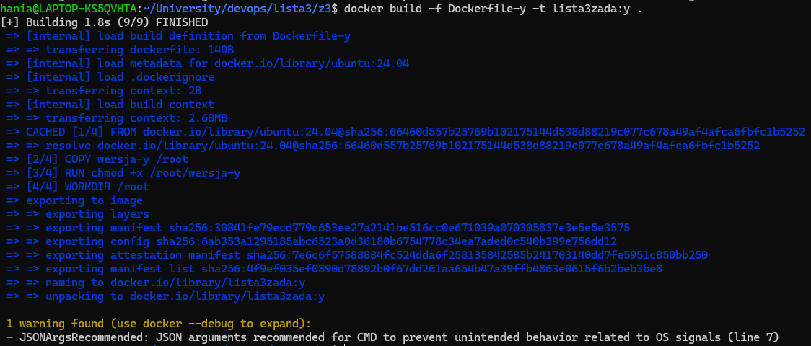

Czym w ogole sa wolumeny w Dockerze?
Docker volumes to mechanizm do trwałego przechowywania danych poza kontenerem. Umożliwiają mapowanie katalogów między hostem a kontenerem, dzięki czemu dane nie są tracone po zatrzymaniu lub usunięciu kontenera, co jest kluczowe np. dla baz danych.

do kasowania nieużywanego wolumenu:
```
docker volume prune
```


docker build -f Dockerfile-x -t lista3zada:x .


docker build -f Dockerfile-y -t lista3zada:y .



Potrójne wykoananie:
docker run -v lista3zada:/root/katalog -it --rm lista3zada:x


Powstaje wowczas volumen o nazwie lista3zada, do ktorego sa zapisywane pliki z katalogu /root/katalog w kontenerze.


plik smok-baza-danych.bin:


docker run -v lista3zada:/root/katalog -it --rm lista3zada:y

Po wykonaniu tego polecenia, plik smok-baza-danych.bin zostanie nadpisany w wolumenie lista3zada danymi wygenerowanymi przez kontener oparty na obrazie lista3zada:y. W naszym przypadku zostanie podmieniony pierwszy znak z @ na null


docker run -v lista3zada:/root/katalog -it --rm lista3zada:y


docker run -v lista3zada:/root/katalog -it --rm lista3zada:x

Zamiast tego zrobimy:

```
docker volume create lista3zada_x 
docker volume create lista3zada_y
docker run -v lista3zada_x:/root/katalog -it --rm lista3zada:x
docker run -v lista3zada_y:/root/katalog -it --rm lista3zada:y
```

Dzieki temu beda istnialy dwa oddzielne wolumeny i pliki w nich nie beda sie nadpisywac.