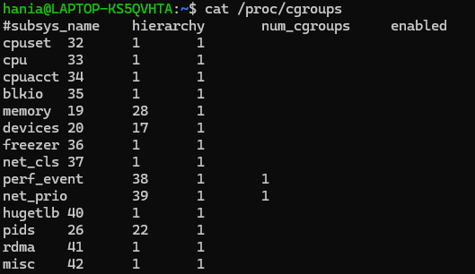
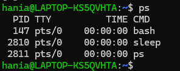
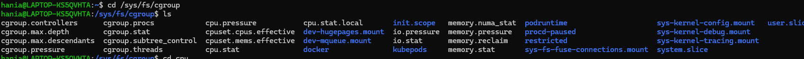
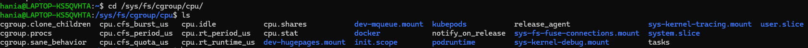
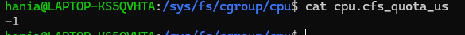
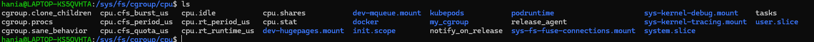
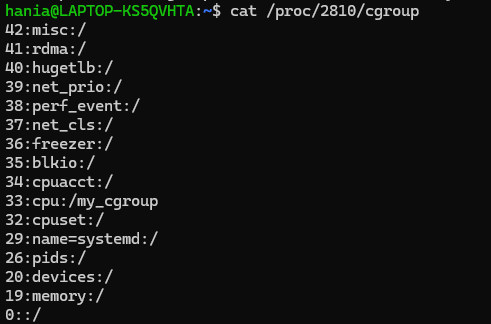
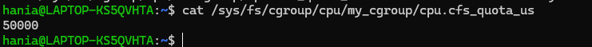
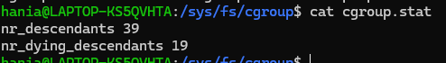

w srodku kontenera znajduja sie cgroup, namespaces, union-capable fs i inne technologie kernela, ktore umozliwiaja izolacje procesow i zasobow systemowych.

namespaces = są funkcją jądra Linux, która dzieli zasoby jądra w taki sposób, że jeden zestaw procesów widzi jeden zestaw zasobów, a inny zestaw procesów widzi inny zestaw zasobów, czyli innymi slowy izoluje procesy od siebie nawzajem.

cgroups = służą do kontrolowania, ile danego zasobu kluczowego (procesora, pamięci, sieci i wejścia/wyjścia dysku) może być wykorzystane przez proces lub zestaw procesów.

Funkcje cgroups:
- ograniczanie zasobów (np. CPU, pamięć RAM)
- priorytetyzacja zasobów - Można kontrolować, ile zasobu (procesora, dysku lub sieci) może wykorzystać proces w porównaniu z procesami w innej grupie cgroup w przypadku konfliktu zasobów.
- rozliczanie zasobów - śledzenie zużycia zasobów przez procesy i raportowanie na poziomie cgroup
- monitorowanie zasobów (frozen, stopped, restarted)


## Jak sprawdzic czy cgrupy są dostępne na Twoim komputerze i w jakiej wersji?

W
grep cgroup /proc/filesystems


```
cat /proc/cgroups
```



Czyli są dostepne w wersji v1.
Z outputu:
- #subsys_name - nazwa cgroupy podsystemu, każdy podsystem zarządza innym zasobem systemowym (cpu, memory, devices, itd.)
- #hierarchy - numer hierarchii cgroupy, w mowszystkich wersjach v1 jest to 0
- #num_cgroups - liczba cgroup w danej hierarchii
- #enabled - czy podsystem jest włączony (1) czy wyłączony (0)

## Dla wybranego
procesu sprawdź, do jakiej cgrupy należy poprzez procfs.

robimy ps, by wyświetlić listę procesów i ich PIDy:

```
ps
```



Następnie wybieramy PID procesu i sprawdzamy do jakiej cgroupy należy:

```
cat /proc/147/cgroup
```
Kolumny to: hierarchy_ID:kontrolery:ścieżka_w_hierarchii


proces 147 należy do cgroup / (czyli głównej) w hierarchii <kontroler>

## Następnie w sysfs sprawdź jakie są ograniczenia nałożone na tę grupę:

```
cd /sys/fs/cgroup
```



```
cat cpu.cfs_quota_us (a Linux kernel parameter that sets the maximum amount of CPU time (in microseconds) a cgroup can use during a single time period)
```


Otrzymaliśmy -1, co oznacza, że nie ma ograniczeń nałożonych na tę grupę w zakresie CPU.


## Jaki serwis utworzył tę grupę i przypisał do niej proces?
- proces nie został przypisany przez systemd (bo systemd zawsze tworzy *.slice lub *.scope),

- proces nie działa w kontenerze,

- więc musiał trafić do domyślnej cgroupy rootowej utworzonej przez kernel.

## Przy pomocy sysfs i procfs: stwórz własną cgrupę, przypisz tam wybrany proces i zademonstruj konfigurację ograniczeń zużycia zasobów

Najpierw tworzymy sobie proces w tle:

```
sleep 1000 &
```

tworzymy cgroupę:

```
sudo mkdir /sys/fs/cgroup/cpu/my_cgroup
```


Następnie przypisujemy nasz proces do tej cgroupy:

```
echo 2810 | sudo tee /sys/fs/cgroup/cpu/my_cgroup/cgroup.procs
```

Jak wejdziemy teraz w:
```
cat /proc/2810/cgroup
```
to zobaczymy, że nasz proces należy już do nowo utworzonej cgroupy my_cgroup.


Nałożemy teraz ograniczenie CPU na tą cgroupę:

```
echo 50000 | sudo tee /sys/fs/cgroup/cpu/my_cgroup/cpu.cfs_quota_us
```
Sprawdzamy czy ograniczenie zostało nałożone:

```
cat /sys/fs/cgroup/cpu/my_cgroup/cpu.cfs_quota_us
```


## Pokaż i omów zawartość przykładowego pliku cgroup.stat.
```
cat /sys/fs/cgroup/cgroup.stat
```



W pliku cgroup.stat znajdują się:
nr_descendants 39
nr_dying_descendants 19

- nr_descendants - liczba bezpośrednich i pośrednich potomków tej cgroupy
- nr_dying_descendants - liczba potomków tej cgroupy, które czekają na usunięcie

