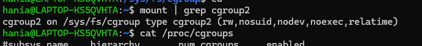
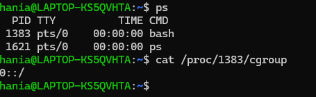

## Jak sprawdzic czy cgrupy są dostępne na Twoim komputerze i w jakiej wersji?

```
mount | grep cgroup2
```



## Dla wybranego
procesu sprawdź, do jakiej cgrupy należy poprzez procfs

```
cat /proc/cgroups
```

```
ps
cat /proc/1383/cgroup
```



## Następnie w sysfs sprawdź jakie są ograniczenia
nałożone na tę grupę. Jaki serwis utworzył tę grupę i przypisał do niej proces?