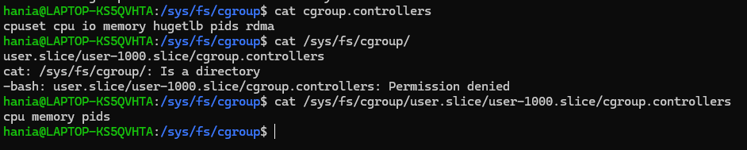

## Czym jest kontroler w cgroup?

Cgroup controllers to moduły jądra Linuksa, które zarządzają różnymi zasobami systemowymi przydzielanymi grupom kontrolnym (cgroups). Każdy kontroler odpowiada za inny typ zasobu, umożliwiając administratorom systemu monitorowanie i ograniczanie zużycia zasobów przez procesy w ramach określonych cgroups.

https://docs.redhat.com/en/documentation/red_hat_enterprise_linux/8/html/managing_monitoring_and_updating_the_kernel/setting-limits-for-applications_managing-monitoring-and-updating-the-kernel

### Controllers available for cgroups-v1:

- blkio - Sets limits on input/output access to and from block devices.
- cpu - Adjusts the parameters of the Completely Fair Scheduler (CFS) for a control group’s tasks. The cpu controller is mounted together with the cpuacct controller on the same mount.
- cpuacct - Creates automatic reports on CPU resources used by tasks in a control group. The cpuacct controller is mounted together with the cpu controller on the same mount.
- cpuset - Restricts control group tasks to run only on a specified subset of CPUs and to direct the tasks to use memory only on specified memory nodes.
- devices - Controls access to devices for tasks in a control group.
- freezer - Suspends or resumes tasks in a control group.
- memory - Sets limits on memory use by tasks in a control group and generates automatic reports on memory resources used by those tasks.
- net_cls - Tags network packets with a class identifier (classid) that enables the Linux traffic controller (the tc command) to identify packets that originate from a particular control group task. A subsystem of net_cls, the net_filter (iptables), can also use this tag to perform actions on such packets. The net_filter tags network sockets with a firewall identifier (fwid) that allows the Linux firewall to identify packets that originate from a particular control group task (by using the iptables command).
- net_prio - Sets the priority of network traffic.
- pids - Sets limits for multiple processes and their children in a control group.
- perf_event - Groups tasks for monitoring by the perf performance monitoring and reporting utility.
- rdma - Sets limits on Remote Direct Memory Access/InfiniBand specific resources in a control group.
- hugetlb - Limits the usage of large size virtual memory pages by tasks in a control group.
### Controllers available for cgroups-v2:

- io - Sets limits on input/output access to and from block devices.
- memory - Sets limits on memory use by tasks in a control group and generates automatic reports on memory resources used by those tasks.
- pids - Sets limits for multiple processes and their children in a control group.
- rdma - Sets limits on Remote Direct Memory Access/InfiniBand specific resources in a control group.
- cpu - Adjusts the parameters of the Completely Fair Scheduler (CFS) for a control group’s tasks and creates automatic reports on CPU resources used by tasks in a control group.
- cpuset - Restricts control group tasks to run only on a specified subset of CPUs and to direct the tasks to use memory only on specified memory nodes. Supports only the core functionality (cpus{,.effective}, mems{,.effective}) with a new partition feature.
- perf_event - Groups tasks for monitoring by the perf performance monitoring and reporting utility. perf_event is enabled automatically on the v2 hierarchy.

## Przedstaw krótkie omówienie najciekawszych Twoim zdaniem ograniczeń, które można nałożyć z użyciem kontrolerów.

- Nałożenie limitu na maksymalną liczbę procesów:

```
echo 10 > /sys/fs/cgroup/pids/testgroup/pids.max
```

- Nałożenie limitu na zużycie pamięci RAM (nie więcej niż 200MB):

```
echo $((200*1024*1024)) > /sys/fs/cgroup/memory/testgroup/memory.limit_in_bytes
```

- Nałożenie limitu na wykorzystanie CPU (50% CPU czasu w ciągu 100ms):
```
echo "50000 100000" > /sys/fs/cgroup/cpu/testgroup/cpu.max
```
## Z czego wynika różnica w zawartości: /sys/fs/cgroup/cgroup.controllers oraz /sys/fs/cgroup/user.slice/user-1000.slice/cgroup.controllers (lub jego odpowiednika)?



Różnica wynika z hierarchicznej struktury grup cgroup: /sys/fs/cgroup to grupa główna, zawierająca wszystkie kontrolery, natomiast /sys/fs/cgroup/user.slice/user-1000.slice/cgroup.controllers to grupa podrzędna, w której kontrolery są włączone dla sesji konkretnego użytkownika (w tym przypadku użytkownika 1000). Grupa główna zawiera wszystkie dostępne kontrolery, natomiast grupa wycinkowa zawiera tylko te kontrolery, które są włączone i dostępne dla danej hierarchii grup cgroup.