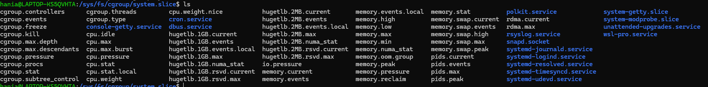
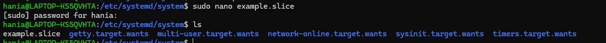
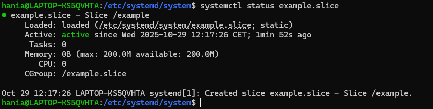
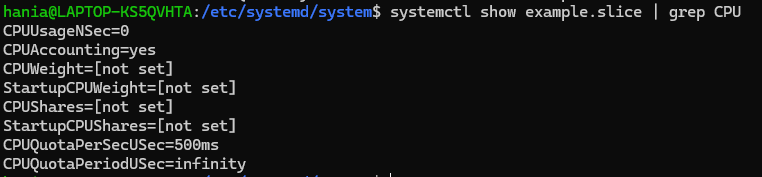
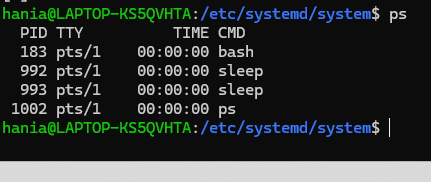
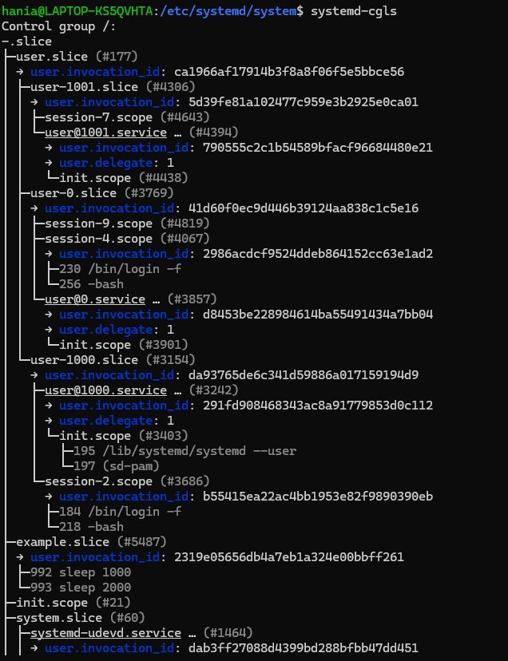
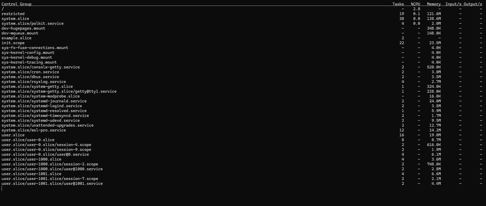

## Czym są slice w systemd?

Systemd to nowoczesny menadżer systemu i usług dla Linuksa, który zarządza procesami i usługami podczas rozruchu systemu oraz w jego trakcie

Slice w systemd to specjalne jednostki (units), które służą do grupowania i zarządzania zasobami procesów. Są one używane do organizowania procesów w hierarchię, co pozwala na lepsze zarządzanie zasobami systemowymi, takimi jak CPU, pamięć i I/O.
.slice używa cgroups do zarządzania zasobami.

Są rózne typy slice, takie jak:
- system.slice: Dla standardowych usług systemowych (np. SSH, serwer WWW).

- user.slice: Dla procesów zalogowanych użytkowników.

- machine.slice: Dla maszyn wirtualnych i kontenerów (np. używanych przez libvirt/podman).
 
Mozemy zobaczyc slice nalozone na cgroups za pomoca polecenia:



Tworzymy w /etc/systemd/system/example.slice plik konfiguracyjny z zawartoscia:

```
[Slice]

MemoryMax=200M
CPUQuota=50%
```



Nastepnie reloadujemy systemd i uruchamiamy slice:

```
sudo systemctl daemon-reload
sudo systemctl start example.slice
```

Mozemy teraz sprawdzic czy slice dziala:

```
systemctl status example.slice
```



Widzimy, ze slice dziala i ma ustawione limity zasobow.

Mozemy podejrzec limit ustawiony na obciazenie cpu:

```
systemctl show example.slice | grep CPU
```



## dodać do niego dwa procesy:

```
sleep 1000 &
sleep 2000 &
```

I sprawdzic ich pid:



Przypisanie procesy do slice:

```
echo 992 | sudo tee /sys/fs/cgroup/example.slice/cgroup.procs
echo 993 | sudo tee /sys/fs/cgroup/example.slice/cgroup.procs
```

lub przez systemd:

```
sudo systemctl set-property --runtime -- system.slice/992 Slice=example.slice
sudo systemctl set-property --runtime -- system.slice/993 Slice=example.slice
```

## Co pokazują polecenia systemdcgtop i systemd-cgls

systemd-cgls pokazuje hierarchię cgroups i procesów w systemie:

```
systemd-cgls
```


natomiasy t systemdcgtop pokazuje dynamiczny widok zużycia zasobów przez cgroups:

```
systemd-cgtop
```



Teraz by ladnie usunac slice i procesy:

```
sudo systemctl stop example.slice
sudo rm /etc/systemd/system/example.slice
sudo systemctl daemon-reload
sudo kill 992 993
systemctl status example.slice
```
