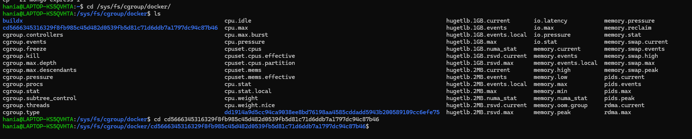
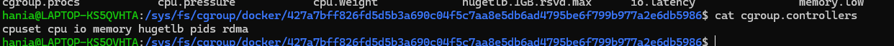

Najpierw odpalamy kontener z pierwszego zadania:

```
docker-compose -f mongo-services.yaml up
```

By dostac pelne id contenera:

```
docker ps --no-trunc
```

Pozniej przechodzimy do srodka kontenera:

```
cd /sys/fs/cgroup/docker/<container_id>
```
i po wpisaniu 
```
cat cgroup.controllers
```
widzimy liste dostepnych controllerow, czyli wlasciwe cgroupy



