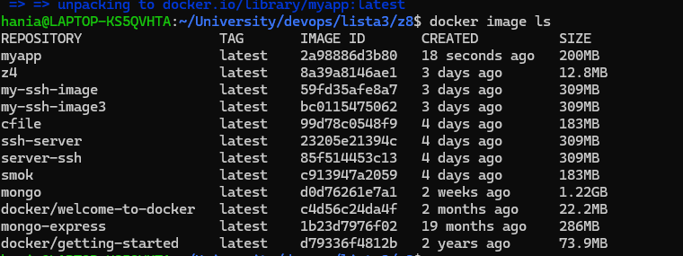

docker compose:
-budowanie wielu kontenerow na raz
- sluzy do odpalania obrazow (run)

docker bake:
- budowanie wielu obrazow na raz (build)

Po co używać docker bake zamiast zwykłego docker build?
- budowanie wielu obrazow na raz
- budowanie obrazow dla wielu architektur => docker buildx bake --platform linux/amd64,linux/arm64
- rozne konfiguracje budowania (inne na dev/prod) => latwa zmiana parametrow konfiguracji
- automatyzowwane budowanie obrazow w CI/CD

BEZ DOCKER BAKE:

```
docker build -t myapp:latest .
docker run -d -p 5000:5000 myapp:latest
```

Z DOCKER BAKE:
```
docker buildx bake -f docker-bake.yml
```

Normalnie docker bake jest w formacie hcl (HashiCorp Configuration Language), ale moze byc tez w formacie yaml. dlatego musmy uzyc flagi -f aby wskazac plik yaml.

```
docker image ls
```


aby usunac obraz:
```
docker rmi <image_id>
```