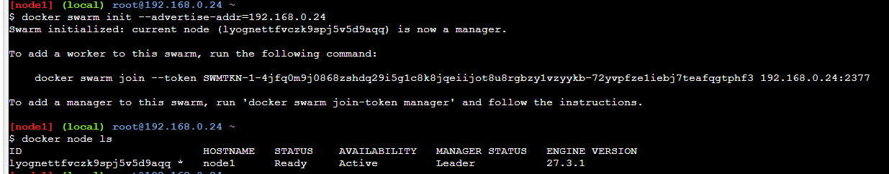
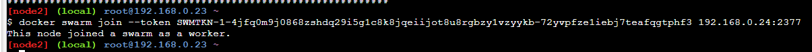
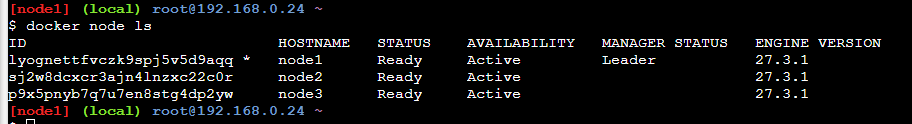
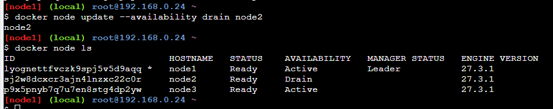

## Zapoznaj się z docker swarm, przygotuj jego krótkie omówienie i zademonstruj przykładowe użycie.

Docker swarm to narzędzie do zarządznia konterenami (orkestracja kontenerów => czyli zarządzanie wieloma kontenerami w środowisku produkcyjnym).

Po co używamy docker swarm?
- Skalowalność: Docker Swarm umożliwia łatwe skalowanie aplikacji poprzez dodawanie lub usuwanie kontenerów w zależności od obciążenia.
- Load balancing: Automatycznie rozdziela ruch sieciowy między kontenery, co poprawia wydajność i dostępność aplikacji.
- Scheduler - automatycznie uruchamia sfailowane aplikacje, dzięki czemu kontenery są zawsze uruchomione.
- Komunikacja TLS między nodami: Zapewnia bezpieczną komunikację między różnymi maszynami w klastrze.

Pojęcia:
- Node: Pojedyncza maszyna (fizyczna lub wirtualna) w Docker Engine
- Cluster: Zbiór nodów zarządzanych jako jedna jednostka
- Docker swarm: Zarządza klastrami, działa jako orchestrator kontenerów

Teraz komendy:

```
docker swarm init
```

Inicjalizuje nowy klaster Docker Swarm na bieżącej maszynie, która staje się menedżerem (manager node).

```
docker node ls
```

Wyświetla listę wszystkich nodów w klastrze Docker Swarm.



Dodanie nodea jako workera:

```
docker swarm join --token <worker_token> <manager_ip>:2377
```


Do wyswietlenia wszystkich nodeow w swarmie:

```
docker node ls
```



Tworzenie usługi w swarmie:

```
docker service create --name my_service -p 80:80 nginx
```

Leader moze dezaktywowac nodey:

```
docker node update --availability drain <node_id>
```



Jest to przydatne podczas konserwacji lub aktualizacji węzłów, ponieważ zapobiega uruchamianiu nowych zadań na tym węźle i przenosi istniejące zadania na inne dostępne węzły w klastrze.

By znowu zaktywowac:
```
docker node update --availability active <node_id>
```