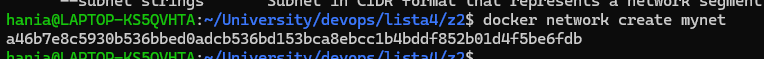
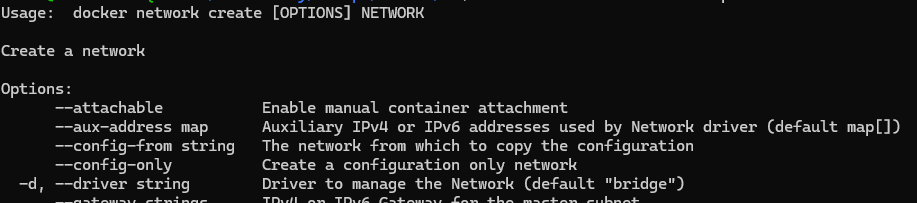
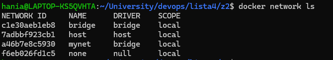
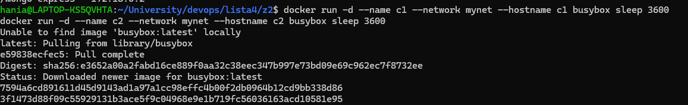
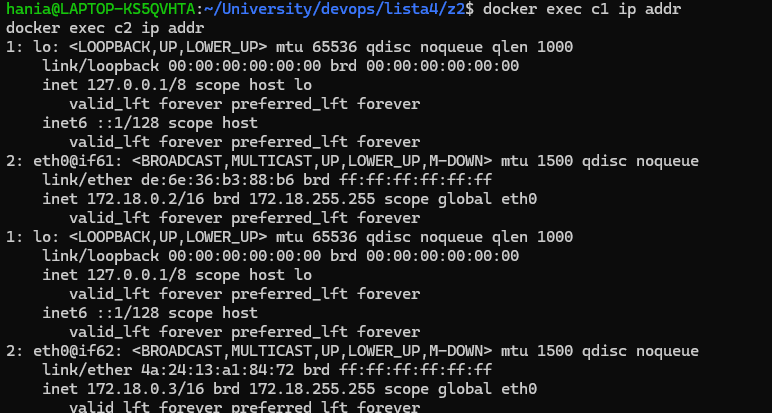
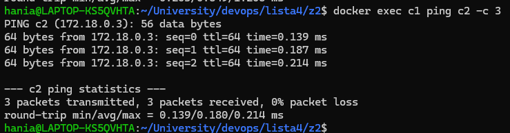
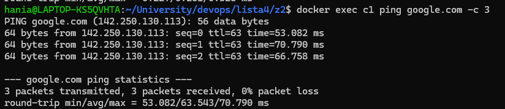
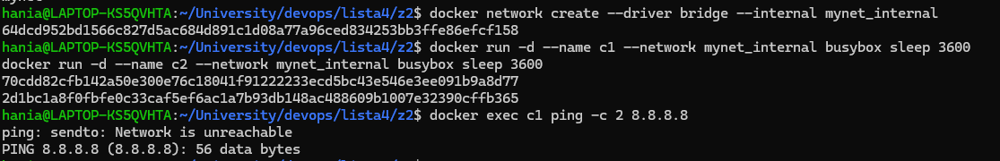
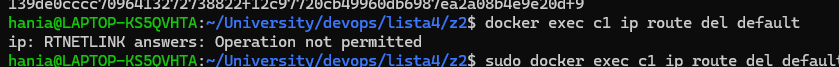

## Zapoznaj się z docker network

Docker network to narzędzie do zarządzania sieciami kontenerów w Dockerze. Umożliwia tworzenie, konfigurowanie i zarządzanie różnymi typami sieci, które umożliwiają komunikację między kontenerami oraz między kontenerami a światem zewnętrznym.

## Utwórz sieć dockera typu bridge i podłącz do niej 2 kontenery

Do utworzenia sieci:

```
docker network create mynet
```


domyślnie network create jest typu bridge:



```
docker network ls
```


Faktycznie typu bridge.

Tworzymy kontenery i podpinamy je do sieci:
```
docker run -d --name c1 --network mynet --hostname c1 busybox sleep 3600
docker run -d --name c2 --network mynet --hostname c2 busybox sleep 3600
```

Czym jest busybox? program komputerowy łączący funkcje podstawowych narzędzi Uniksa w jednym pliku wykonywalnym. ma wbudowanego pinga i ip addr a tego potrzebujemy w tym zadaniu dlatego to.



sprawdzamy ip addr:

```
docker exec c1 ip addr
docker exec c2 ip addr
```



##  Pokaż, że kontenery te są w stanie się komunikować.
Wykonujemy pinga z jednego kontenera do drugiego: (mozemy to tez zrobic przez wczesniej uzyskane adresy ip)

```
docker exec c1 ping c2 -c 3
docker exec c2 ping c1 -c 3
```



## Czy są w stanie połączyć się z Internetem?

```
docker exec c1 ping google.com -c 3
docker exec c2 ping google.com -c 3
```



https://docs.docker.com/engine/network/drivers/bridge/

Tak, będą w stanie połączyć się z Internetem poprzez sieć hosta.
"Allows unrestricted network access to containers in the network from the host, and from other containers connected to the same bridge network."

## Jak to zablokować?

- Mozemy dodac flage --internal przy tworzeniu sieci:


```
docker network create --driver bridge --internal mynet_internal
docker run -d --name c1 --network mynet_internal busybox sleep 3600
docker run -d --name c2 --network mynet_internal busybox sleep 3600
```



- Mozemy usunac brame domyslna w kontenerze:

```
docker exec c1 ip route del default
```
Ale musimy to zrobic dla kazdego kontenera osobno, mozna to tez obejsc, robilismy na sieciach

dodatkowo podczas tworzenia kontenera musimy dodac flage  --cap-add=NET_ADMIN, bo inaczej nie bedziemy mieli uprawnien, ja sie w to nie bawilam...

