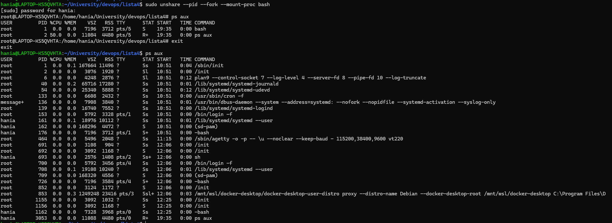
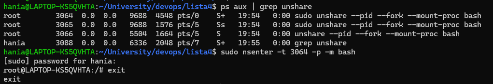
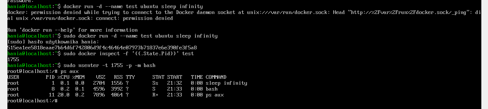
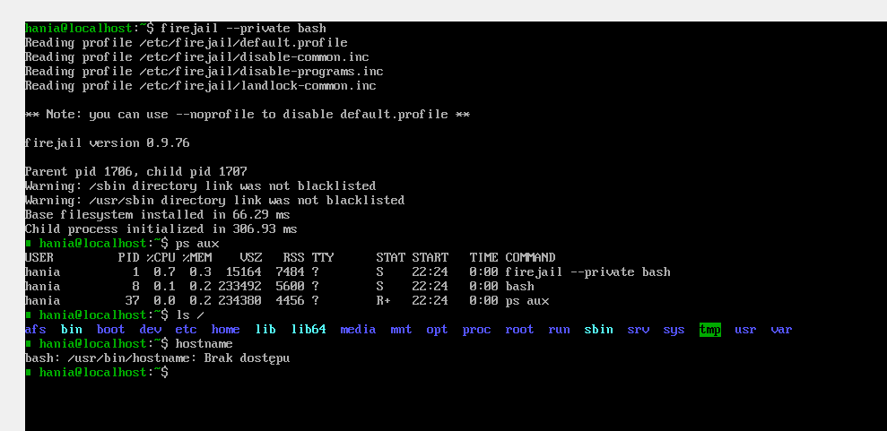
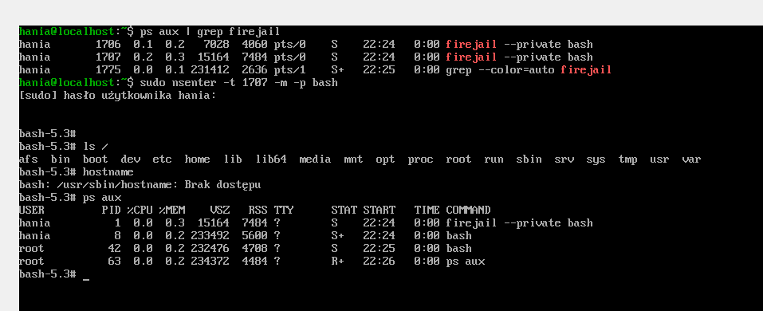

## Przedstaw i zademonstruj użycie polecenia unshare i nsenter. 

unshare - pozwala uruchomić proces w nowej przestrzeni nazw (namespace), co umożliwia izolację różnych zasobów systemowych, takich jak przestrzeń PID, sieć, system plików itp.

```
sudo unshare --pid --fork --mount-proc bash
```
Powyższe polecenie uruchamia nową powłokę bash w oddzielnej przestrzeni PID, co oznacza, że procesy uruchomione w tej powłoce będą miały własne identyfikatory PID, niezależne od tych w głównym systemie.



nsenter - pozwala wejść do istniejącej przestrzeni nazw innego procesu. Jest to przydatne, gdy chcemy uzyskać dostęp do zasobów izolowanych przez unshare lub kontenery.

```
ps aux | grep unshare
sudo nsenter -t <PID> -p -m bash
```
-t - identyfikator procesu, do którego chcemy wejść
-p - przestrzeń PID
-m - przestrzeń montowania systemu plików



### Uruchom kontener dockera i pokaż, że separacja przestrzeni PID-ów rzeczywiście zachodzi. 

```
sudo docker run -d --name pid_test ubuntu sleep infinity
docker inspect -f '{{.State.Pid}}'
```

## Użyj nsenter, by wejść do kontenera i uruchomić shella. 

```
sudo nsenter -t <PID> -p -m bash
ps aux
```



## Uruchom dowolny proces z użyciem firejail, który ograniczy dostęp do systemu plików. 

```
firejail --private bash
ps aux | grep firejail

```


## Pokaż, że przy pomocy nsenter można uruchomić shella w tym ograniczonym widoku.

```
ps aux | grep firejail
sudo nsenter -t <PID> -p -m bash
ps aux
```
