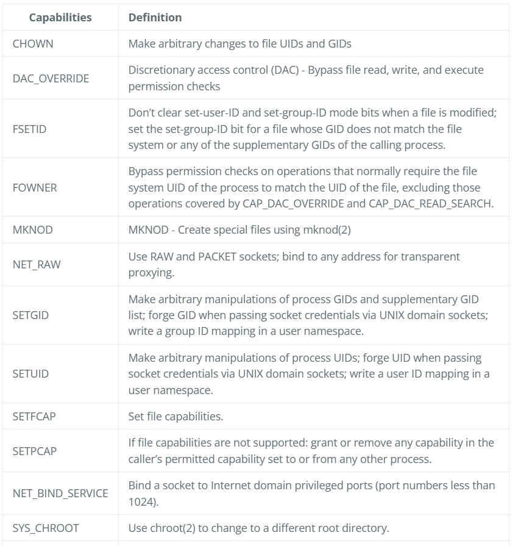
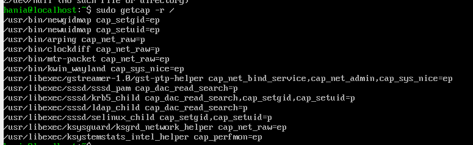
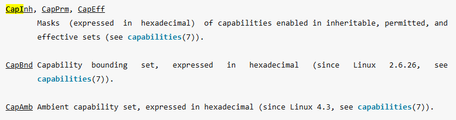

## Wytłumacz czym są capabilities powiązane z plikami.

https://dockerlabs.collabnix.com/advanced/security/capabilities/

Capabilities powiązane z plikami to odrębne jednostki pozwalające użytkownikowi root na wprowadzanie określonych zmian
Np. CAP_CHOWN pozwala użytkownikowi root na wprowadzanie dowolnych zmian w identyfikatorach UID i GID plików.

Prawie wszystkie specjalne uprawnienia związane z użytkownikiem root Linuksa są podzielone na indywidualne uprawnienia czyli capabilities. Capabilities pozwalają na otwieranie plików z wyższymi uprawnieniami bez konieczności nadawania pełnych uprawnień roota.



## Przy pomocy getcap znajdź wszystkie pliki binarne w Twoim systemie, które używają tej funkcjonalności

```
sudo getcap -r / 
``` 


e - effective
p - permitted

## Czy dodatkowe uprawnienia są uzasadnione?
To zależy od programu i kontekstu.
Na przykład programy takie jak ping czy traceroute potrzebują specjalnych uprawnień do otwierania surowych gniazd sieciowych, co wymaga uprawnień CAP_NET_RAW. W takich przypadkach przyznanie tych uprawnień jest uzasadnione, ponieważ umożliwia prawidłowe działanie programu bez konieczności nadawania pełnych uprawnień roota.

## Uruchom kontener dockera i sprawdź z użyciem ps jakie uprawnienia otrzymują procesy wewnątrz kontenera. Czy widzisz jakieś ryzyko?


```
docker run --rm -it ubuntu:24.04 bash
apt update && apt install -y libcap2-bin
apt install -y procps
ps
getpcaps 1
```

i otrzymujemy:
cap_chown,cap_dac_override,cap_fowner,cap_fsetid,cap_kill,cap_setgid,cap_setuid,cap_setpcap,cap_net_bind_service,cap_net_raw,cap_sys_chroot,cap_mknod,cap_audit_write,cap_setfcap=ep

lub:
```
grep Cap /proc/1/status
``` 
i otrzymujemy:
CapInh: 0000000000000000
CapPrm: 00000000a80425fb
CapEff: 00000000a80425fb
CapBnd: 00000000a80425fb
CapAmb: 0000000000000000

Ryzyko jest takie, że jeśli aplikacja wewnątrz kontenera zostanie skompromitowana, atakujący może wykorzystać te uprawnienia do eskalacji swoich uprawnień i wykonania złośliwych działań na hoście lub innych kontenerach.

## Pokaż, w jaki sposób uruchomić kontener ograniczając mu uprawnienia przyznawane domyślnie.

```
docker run --rm -it --cap-drop ALL ubuntu:24.04 bash
grep Cap /proc/1/status
```
i otrzymujemy:

CapInh: 0000000000000000
CapPrm: 0000000000000000
CapEff: 0000000000000000
CapBnd: 0000000000000000
CapAmb: 0000000000000000



W ten sposób uruchamiamy kontener bez żadnych dodatkowych uprawnień, co minimalizuje ryzyko związane z potencjalnymi atakami.