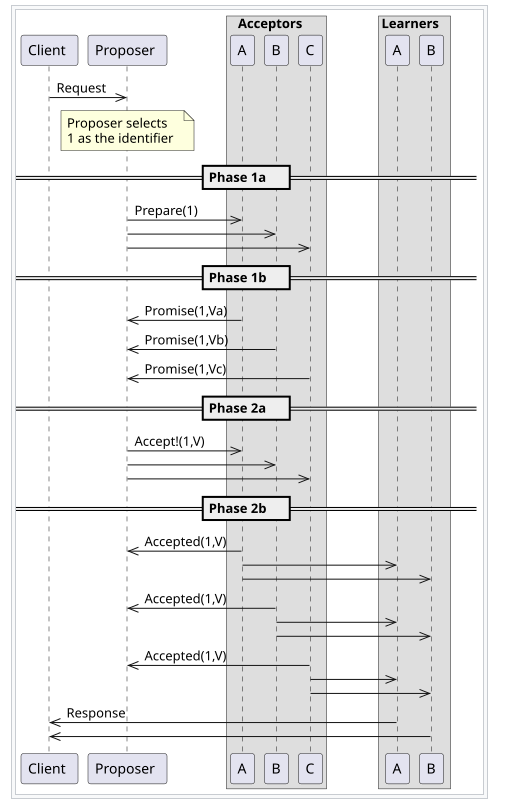

## Czym są algorytmy wyznaczania konsensusu? 

Algorytmy wyznaczania konsensusu to zestawy reguł i procedur, które umożliwiają grupie uczestników w sieci zdecentralizowanej osiągnięcie porozumienia co do stanu systemu lub wartości danych, mimo braku zaufania między nimi. (na przykład w blockchain).
Ogólnie: Algorytmy konsensusu pozwalają wiele węzłom zgodzić się na jedną wartość, nawet jeśli część z nich padnie.

##  Czemu możemy ich potrzebować?

Pomagają zapewnić integralność danych, zapobiegają podwójnemu wydawaniu środków i umożliwiają bezpieczne dodawanie nowych bloków do łańcucha bloków.

W Kubernetesie nie ma jednego "algorytmu konsensusu" w takim samym znaczeniu, jak w przypadku blockchain. Zamiast tego, Kubernetes wykorzystuje algorytm, który pozwala na osiągnięcie spójności stanu klastra i jest oparty na mechanizmie Dueling-DBS, który zapewnia integralność danych dla operacji zarządzania stanem klastra. Ten mechanizm jest stosowany w systemach o dużej skali, w tym w systemie rozproszonym o nazwie etcd. 

## Przedstaw przykładowy (np. Paxos)
W PAXOSIE są trzy role:
- Proposer – proponuje nową wartość

- Acceptor – głosuje na propozycję

- Learner – dowiaduje się o wyniku

Etapowo:

1. Proposer pyta acceptorów o zgodę (prepare)

2. Acceptor odpowiada, że przyjmuje propozycję (promise)

3. Proposer wysyła finalną wartość (accept request)

4. Acceptor zatwierdza i przekazuje dalej (accepted)

Gwarancja bezpieczenstwa (spojnosci):
1. Można wybrać i zapamiętać tylko proponowane wartości.
2. Dwaj odrębni uczący się nie mogą zapamiętać różnych wartości (lub nie może być więcej niż jedna ustalona wartość)
3. Jeśli wartość została zatwierdzona przez większość, to każda późniejsza propozycja musi zawierać tę wartość lub wartość z większym numerem propozycji.
