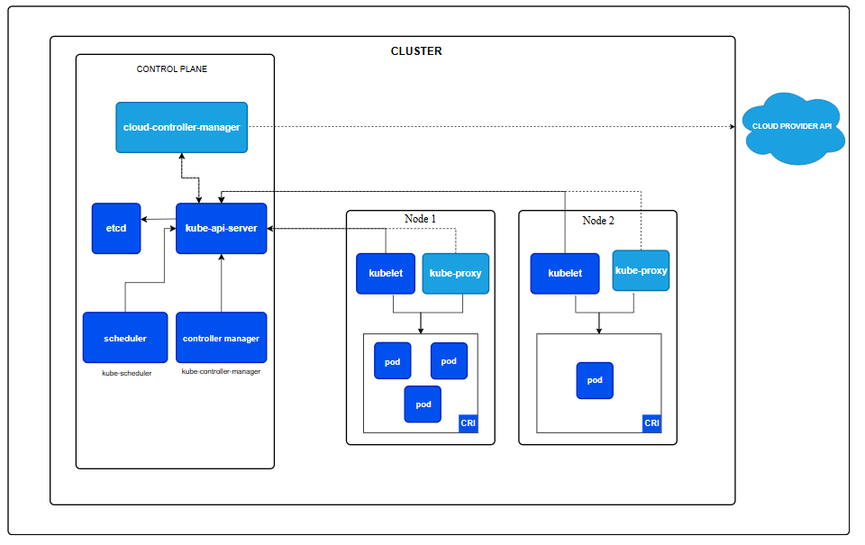

## Co się stanie jak węzeł, przestanie odpowiadać na pingi od control plane? 

https://kubernetes.io/docs/concepts/architecture/

jak widac na rysunku wewnatrz control plane znajduje sie kube-controller-manager, na ktorego sklada sie wiele kontrolerow, jednym z nich jest Node Controller - odpowiedzialny za monitorowanie stanu węzłów w klastrze Kubernetes.

https://kubernetes.io/docs/concepts/architecture/nodes/#node-controller
https://kubernetes.io/docs/reference/node/node-status/

- By default, the node controller checks the state of each node every 5 seconds. 
- If a node remains unreachable: triggering API-initiated eviction for all of the Pods on the unreachable node. By default, the node controller waits 5 minutes between marking the node as Unknown and submitting the first eviction request.
- The kubelet updates the node's .status either when there is change in status or if there has been no update for a configured interval. The default interval for .status updates to Nodes is 5 minutes, which is much longer than the 40 second default timeout for unreachable nodes.
- 
## Czym jest eviction rate i czemu zostało wprowadzone? 

Eviction rate to mechanizm kontrolujący tempo usuwania (eviction) podów z węzłów, które stały się niedostępne lub niezdolne do działania.
Zostało wprowadzone, aby zapobiec masowym usunięciom podów w przypadku awarii wielu węzłów jednocześnie, co mogłoby prowadzić do przeciążenia klastra i zakłóceń w działaniu aplikacji.

" The node controller checks what percentage of nodes in the zone are unhealthy (the Ready condition is Unknown or False) at the same time:

If the fraction of unhealthy nodes is at least --unhealthy-zone-threshold (default 0.55), then the eviction rate is reduced.
If the cluster is small (i.e. has less than or equal to --large-cluster-size-threshold nodes - default 50), then evictions are stopped.
Otherwise, the eviction rate is reduced to --secondary-node-eviction-rate (default 0.01) per second. "

##  Co nam daje pod disruption budget?

https://kubernetes.io/docs/concepts/workloads/pods/disruptions/#pod-disruption-budgets

Pod Disruption Budget (PDB) to mechanizm w Kubernetes, który pozwala na określenie minimalnej liczby replik podów, które muszą pozostać dostępne podczas planowanych zakłóceń (disruptions), takich jak aktualizacje węzłów czy skalowanie klastra. Dzięki PDB możemy zapewnić ciągłość działania aplikacji, nawet podczas operacji konserwacyjnych.

https://kubernetes.io/docs/concepts/workloads/pods/disruptions/#pdb-example