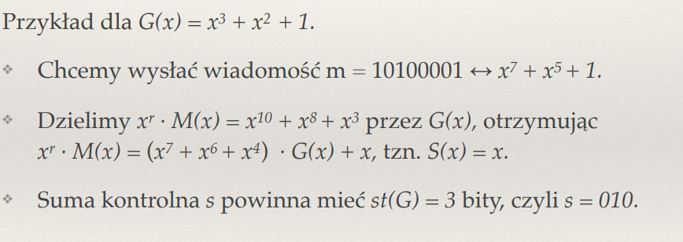
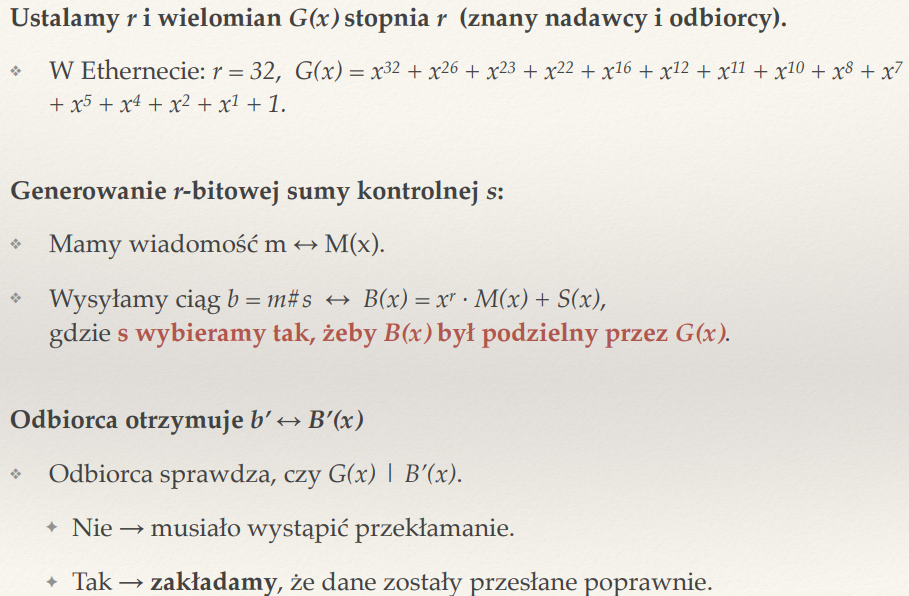
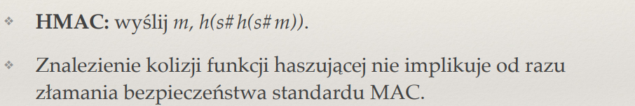

## Jakie znasz typy kodów detekcyjnych? Do czego służą i jakie są między nimi różnice?

sumy kontrolne - np bit parzystosci dodanie jednego bitu i sprawdzanie sumy 
kody CRC - cyclic redundacy check - wielomiany i dzielenie
kody MAc - Message Authechentication code - kody uwierzytelniajace zapewniajace integralnosc

## Jakie rodzaje błędów mają wykrywać kody detekcyjne? Z czego biorą się błędy przy przesyłaniu danych?

Przeklamania parzystosci bitow, przeklamania na kolejnych k bitach, bledy na biatch oddalonych o k. 
Najczesciej sa to bledy w warstwie fiycznej

## Jak działa algorytm obliczania sum kontrolnych CRC?

oppiera sie on na dzieleniu wielomainow nad cialem F2 
Bierzemy wielomian M wiadomosc, mnożymy wiadomość przez stopien G
następnie otrzymaną liczbę dzielimy przez G i dodajemy na koniec
wiadomości.(suma kontrolna ma tyle bitow jaki stopien mial wileomian kontrolny G)

## W jaki sposób działa wykrywanie błędów przy sumie kontrolnej CRC?                  

Odbiorca tez liczy sume kontrolna
jezdli reszta z dzielenia = 0 -> nie doszlo do przeklamania

jesli != 0 -> jest blad

## Jakie znasz metody korygowania błędów w transmisji?

Kody Hamminga, kody korekcyjne

## Co to jest (a,b)-kod? Podaj przykład.

a, b kod to rodzaj kodowania ktore wiadomosc o dlugosci b wydluza do dlugosci a

Kod Hamminga(7,4) - wydluza wiadomosci dlugosci 4 dodajac 3 bity parzystosci

## Co to jest odległość Hamminga? Jak wpływa na możliwość detekcji i korekcji błędów?

To odlegnosc, ktora mowi ile bitow mozna flipnac by zmienic jeden szyfrogram w inny poprawny szyrogram. 
Jezeli odleglosc hamming awynosi k, to oznacza ze mozemy wykryc k -1 bledow pojedynczych bitow
i k-1 /2 skorygowac bledow pojedynczych bitow

## Do czego służą kody MAC? Co to jest HMAC?

MAC sluza do zapewnienia integralnosci i uwierzytelnienia. korzystaja z algorytmow kryptograficznych by zapewnic  że dane nie zostały zmienione w trakcie transmisji i że pochodzą od autentycznego nadawcy.

Nadawca i odbiorca dzielą wspólny tajny klucz.

Nadawca oblicza MAC na podstawie wiadomości i klucza:
MAC = f(klucz, wiadomość)

Wysyła: wiadomość + MAC

Odbiorca używa tego samego klucza i funkcji f() do sprawdzenia, czy otrzymany MAC się zgadza.

podatny na atak przedluzeniowy w niektorych wariantach

HMAC to standard wykorzystujacy funkcje skrotu (np SHA - 256)

## Jakie własności powinna mieć kryptograficzna funkcja skrótu?

odporna na kolizje
deterministycznosc -> ta sama wiadomosc ten sam skrot
szybkosc i wydajnosc
Dla danego m1, nie da się znaleźć m2 ≠ m1, takiego że hash(m1) = hash(m2)
jednokierunkowosc

## Czym różni się poufność od integralności?

poufnosc - tylko osoby w kanale nadawczym wiedza co jest wysylane

integralnosc - wykrywanie zlosliwych zmian w przesylanej wiadomosci

## Co to są szyfry monoalfabetyczne? Dlaczego łatwo je złamać?

np szyfr cezara; korzystaja z przesuniecia lietr o staly wspolczynnik, np a -> d, b -> e itp
latwo zlamac, bo niektoree lietry alfabetu wystepuja czesciej, dodatkowo jak dstanie sie jedna pare liiter, wszystkie inne tez sa jawne

## Na czym polegają ataki z wybranym tekstem jawnym, znanym tekstem jawnym i znanym szyfrogramem?

z wybranym tekstem jawnym - adewrsarz zmusza do wyslania wszystkich liter alfabetu 

znanym tekstem jawnym - adwersarz Przechwycił szyfrogram, zna czesc oryginalnej wiadomosci; probuje wydedukowac klucz na podstawie innych zaszyfrowanych wiadomosci

znannym szyfrogramem - adwersarz Przesyła dowolny szyfrogram do systemu; uzyskusje odpowiadajacy tekst jawny; Na podstawie tej wiedzy próbuje odszyfrować inne wiadomości lub poznać klucz.

## Co to jest szyfrowanie one-time pad?

szyfrowanie symetrczyne polegajace na xorowaniu wiadomosci z ustalonym kluczem

## Na czym polega szyfrowanie blokowe? Czym różni się tryb ECB od CBC?

szyfrowanie blokowe polega na odzielnym szyfrowaniu kazdego bloku plaintextu

ECB - elctronic codeblock - te same bloki beda mialy te same szyfrogramy co jest slabe, kazdy blok szyfrowany tym samym kluczem

CBC - cipher block chaining

mamy IV = r1, ktory sluzy nam do zaszyfrowania pierwszego bloku; otrzymuje s1, ktory bedzie nam sluzyl jako klucz do zaszyfrowania kolejnego bloku; 
czyli si = Ek(mi xor si-1). wady - trudny do zrownoleglenia, liniowy