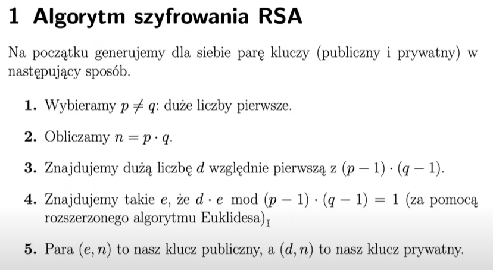

## Czym szyfrowanie symetryczne różni się od asymetrycznego?

W szyfrowaniu symetrycznym mamy ustalony przez obie strony klucz

W szyfrowaniu asymetrycznym kazda ze stron ma dwa klucze - publiczny i prywatny

## Na czym polega bezpieczeństwo przy szyfrowaniu asymetrycznym?

Ewentualna proba odszyfrowania wiadomosci jest kosztowna czasowo, ale nie niewykonalna.
Szyfrujemy wiadomosci czyims kluczem publicznym, a osoba ktora chce ja odszyfrowac robi to swoim kluczym prywatnym ktory zna tylko ona.

## Opisz algorytm RSA.

## Czy różni się szyfrowanie od uwierzytelniania?

Uwierzytelnianie to proces potwierdzeni tozsamosci osoby z jaka sie kontaktujemy, szyfrowanie polega na utajnieniu tresci wiadomosci

## Co to jest atak powtórzeniowy?

Atak powtorzeniowy polega na nagraniu transmisji i jej powtorzeniu:
- Sesje logowania: Jeśli token sesji nie ma ograniczenia czasowego lub nie jest powiązany z urządzeniem, można go przechwycić i użyć później.
- Przelewy bankowe: Atakujący może powtórzyć żądanie przelewu pieniędzy, jeśli system nie zabezpiecza się przed duplikatami.

## Czy w szyfrowaniu asymetrycznym szyfrujemy kluczem publicznym czy prywatnym?

Szyfrujemy czyims kluczem publicznym wiadomosci, podpis cyfrowy robimy swoim kluczem prywatnym

## Na czym polega podpisywanie wiadomości? Jakim kluczem to robimy?

Polega na wygenerowaniu podpisu cyfrowego ktory zamieszczamy do wiadomosci. Robimy to wlasnym kluczem prywatnym.

## Jak można wykorzystać podpisy cyfrowe do uwierzytelniania?

podpis cyfrowy pozwala na uwierzytelnienie tozsamosci nadaawcy, integralnosc danych i niezaprzeczalnsc - bo tylko wlasciciel klucza prywatnego ma do niego dostep, wiec nikt inny nie moze sie za niego podpisac, co najwyzej odszyfrowac wiadomosc przez niego podpisana korzystajac z klucza publicznego

## Czy HMAC można wykorzystać do uwierzytelniania? Czy HMAC jest podpisem cyfrowym?
MOzna, nie jest podpisem cfrowym, poniewaz:
wlasnosc podpisu cyfrowego - moga go sprawdzic wszyscy, ale wykonac go moze tylko jedna osoba
HMAC mzoe wykoanac kazda osoba ktora zna sekret s, a zweryfikowac tez tylko osoba ktora zna s

## Dlaczego lepiej podpisywać funkcję skrótu wiadomości niż samą wiadomość? Z jakim ryzykiem się to wiąże?

jest to tez szybsze rozwiazanie i bardziej wydajne
ktos moze odszyfrowac wiadomosc i podpisac wlasnym podpisem; 
ulatwia implementacje - podpis ma stala dlugosc niezaleznie od tresci

## Co to są certyfikaty? Co to jest ścieżka certyfikacji?

certyfikaty to potwierdzenia, ze dana strona/ osoba ktora sie za cos podaje faktycznie tym jest; zawieraja klucz publiczny tej osoby i sa wystawiane przez zaufany urzad certyfikacji (CA) tzw bezpieczna trzecia strona
sciezka certyfikacji to lancuch certyfikatow potwierdzajacych swoją autentycznosc od danego certyfikatu do roota

## Co to jest urząd certyfikacji (CA)?

Niezalezna zaufana instytucja: -  Certificate Authority
- wystawiajaca certyfikaty 
- potwierdzajaca tzsamosc osob
- gwarantuje ze dany klucz publiczny nalezy do konkrtnego wlasciciela

## Jak TLS zapewnia bezpieczeństwo połączenia?

stosuje symetryczny klucz sesji; ale do nawiazywanie polaczenia (handshake) jest wykorzystywane szyfrowanie asymetryczne; znajduje sie miedzy warstwa transportowa a aplikacji
Większość popularnych usług ma swoje warianty wykorzystująca SSL np.
HTTPS = HTTP over SSL

## W jaki sposób w TLS następuje uwierzytelnienie serwera, z którym się łączymy?

1. handshake i nawiazanie polaczenia
2. serwer odpowiada i wysyla certyfikat
3. weryfikujemy przeslany nam certyfikat, sprawdzana jest jego waznosc i poprawnosc
4. ustalany jest wspolny sekret
5. mozna sie bezpieznie komunikowac

## Co to są klucze sesji? Po co się je stosuje?

Klucz sesji to tymczasowy symetryczny klucz kryptograficzny wykorzystywany tylko podczas jednej sesji komunikacji, jest wspoldzielony miedzy klientem a serwerem, wykorzystywany jest do szyfrowania i deszyfrowania danych

Wykorzystywane sa w celu zapewnienia poufnosci, bezpieczenstwa i szybkosci dzialania (szyfrowanie symetryczne szybsze niz asymetryczne)

## Co to są kolizje kryptograficznej funkcji skrótu?

Dwa rozne dane wejsciowe daja ten sam skrot (hash)
m != m'
h(m) = h(m')

## Na czym polega atak urodzinowy? 

Tworzone sa dwa zbiory wiadomosci, ooba wielkosci 2"40
istnieje ppb omega(1), e istnieje m w zbiorze X i m' w zbior\e Y t, że h(m) = h(m')

Atakujący generuje dużo różnych danych wejściowych (np. losowe pliki, wiadomości)

Oblicza dla nich hashe

Porównuje je między sobą, szukając dwóch różnych danych z tym samym hashem

Gdy znajdzie – mamy kolizję