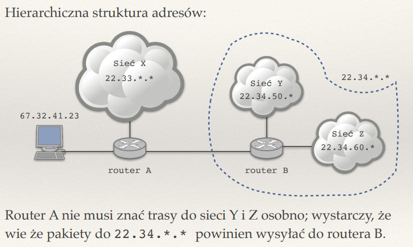

## ??? Z czego wynika hierarchia adresów IP? Jaki ma wpływ na konstrukcję tablic routingu?

Kiedyś -> podział na klasy adresowe A , B , C
Współcześnie -> CIDR 
Grupujemy adresy zgodnie z organizacją lub lokalizacją, przez co prościej routerom jest przerzucać pakietami.
Na przykład:


Przez to w tablicy routingu będziemy mieli zakresy adresów obsługiwane przez konkretne routery (zakresy mogą na siebie nachodzić, zawsze wybieramy ten prefiks, który jest najdłuższy -> czyli najdokładniejszy)


## Notacja CIDR

CIDR - Classless Inter-Domain Routing opisuje zakres adresów IP posiadających wspólny prefiks za pomocą pary (pierwszy adres z zakresu, długość prefiksu)

Przykład:
0.0.0.0/0 to wszystkie możliwe adresy IP
34.56.78.90/32 -> to już konkretny adres; jednoelementowy zbiór


## Co to jest adres rozgłoszeniowy? 
broadcast to ostatni adres, który należy do puli adresów w sieci. Jezeli jakikolwiek pakiet zostanie wysłany do adresu rozgloszeniowego, to przekaze on ten pakiet do wszystkich adresow IP w tej sieci


## Co to jest maska podsieci

Maska podsieci jest rownowazna dlugosci prefiksu; składa się z 32 bitów
Generalnie w postaci bitowej sklada sie z jedynek -> w miejscu wskazujacym na czesc sieciową i zer w miejscu wskazujacym na czesc hostową
Dzieki niej latwo mozemy uzyskac adres sieci => wystarczy ze zrobimy AND na adresie IP z maską podsieci

## Opisz sieci IP klasy A, B i C.

W momencie gdy IP zaczynało się od 0 -> jego maska podsieci automatycznie wynosila /8 i oznaczalo to klasę A
Dla B: od 10 -> maska podsieci wynosila /16
Dla C: od 110 -> maska podsieci wynosila /24

Klasa A definiowala najwieksza klase adresow -> moglo ich byc 2^24

Zastapione przez CIDR.

## Co to jest pętla lokalna (loopback)?

Petla lokalna pozwala na testowanie aplikacji sieciowych bez polaczenia z siecia. Ten specjalny mechanizm sieciowy pozwala na komunikacje z samym soba. Korzysta on z loopback interface. Najczesciej ma przypisany adres IP: 127.0.0.1.
Pozwala na testowanie usług sieciowych.

## Do czego służy pole TTL w pakiecie IP? Do czego służy pole protokół?

TTL czyli Time To Live; to pole, określa maksymlany czas życia pakietu - jest zmniejszane o 1 za każdym razem jak pakiet przechodzi przez kolejny router; w momencie gdy wyniesie 0 pakiet jest odrzucnt i otrzymujemy komunikat ICMP 'time exceeded'. To pole zapobiega nieskończonemu krążeniu pakietów w sieci.

Pole protokół określa jaki protokół transportowy jest używany w warstwie wyższej (1 - ICMP, 6 - TCP, 17 - UDP). Pomaga prawidlowo obsluzyc dane ktore znajduja sie w pakiecie przez routery


## Jakie reguły zawierają tablice routingu?

- Zawierają informację o prefiksie CIDR i do jakiego wówczas routera ma być przekazany pakiet
- jezeli pakiet nie pasuje do zadnej reguly w tablicy routingu, to wowczas jest odrzucany
- jezeli kilka regul pasuje do pakietu, wybierana jest ta o najdluzszym pasujacym prefiksie


## Na czym polega reguła najdłuższego pasującego prefiksu?

Jezeli kilka regul w tablicy roitingu odpowiada pakietowi ktory chcemy przekierowac, to wybieramy te najbardziej konkretna -> czyli tą, która bedzie miala najdluzszy wspolny prefiks z IP pakietu


## Co to jest trasa domyślna?

0.0.0.0/0 najbardziej ogólna reguła, pasują do niej wszytskie możliwe adresy IP


## ??? Do czego służy protokół ICMP? Jakie znasz typy komunikatów ICMP? 
ICMP (Internet Control Message Protocol)
Jest wykorzystywany w warstwie sieciowej (jest czescia protokolu IP), umozliwia wysylanie komunikatow informacyjnych i bledow miedzy urzadzeniami w sieci
typy:
* 8 - echo request
* 0 - echo reply


## Jak działa polecenie ping?

Nadawca wysyła pakiet ICMP echo request (typ 8) do wybranego adresu IP
Jezeli host docelowy jest osiagalny, to odsyla ICMP echo reply (typ 0)
ping zwraca tez RTT
uzywany ddo testowania polaczenia


## Jak działa polecenie traceroute?
Wysyłamy pakiety ICMP echo request (typ 8) z kolejnymi wartosciami TTL = 1, 2, ... , 30
Kazdy router przez ktory przechodzi pakiet zmniejsza TTL o 1. JEzeli TTL = 0 to wowcza czas zycia pakietu wygasa i jezeli jeszcze nie zostal osiagniety adres docelowy, to zwiekszammy TTL o 1. Proces powtarzamy do momentu osiagniecia hosta docelowego (lub przekroczenia wartosci 30 na TTL); jezeli uda nam sie polaczyc to otrzymamy ICMP echo reply (typ 0)


## ??? Dlaczego do tworzenia gniazd surowych wymagane są uprawnienia administratora?

Gniazda surowe maja bezposredni dostep do warstwy sieciowej i pozwalaja na wlasnoreczne tworzenie naglowkow pakietow. Dlatego wymagane sa uprawnienie administratora w celu zapobieganiu naduzyc i atakow w sieci; chronic siec przed nieautoryyzowanym dostepem


## Co to jest sieciowa kolejność bajtów?

sieciowa kolejnosc bajtów czyli big ednian to sposob w jaki dane wielobajtowe (np liczby) sa przesylane przez siec. W tym przypadku mamy "najwazniejszy bajt jako pierwszy". Rozne arcjhitektury komputerowe moga inaczej przechowywac liczby calkowite; inaczej dane mogą zostać zle zinterpretowane


## Co robią funkcje socket(), recvfrom() i sendto()?
socket() - tworzy gniazdo, czyli punkt komunikacyjny do przesylania danych

```
int sockfd = socket(AF_INET, SOCK_RAW, IPPROTO_ICMP);
```

recvfrom() - sluzy do odbierania danych z gniazda; oprocz danych podaje adres nadawcy

```
ssize_t packet_len = recvfrom (sockfd, buffer, IP_MAXPACKET, 0,
 (struct sockaddr*)&sender, &sender_len);
 ```

sendto() - wysyla dane do okreslonego adresu docelowego; podajemy dane, ich rozmiar oraz adres odbiorcy

```
ssize_t bytes_sent = sendto (
 sockfd,
 &header,
 sizeof(header),
 0,
 (struct sockaddr*)&recipient,
 sizeof(recipient)
);
```


## Jakie informacje zawiera struktura adresowa sockaddr_in?

_family_t sin_family;  // Rodzina adresów (np. AF_INET)
in_port_t sin_port;  // Port (w formacie sieciowym)
struct in_addr sin_addr;  // Adres IP

sin = socket INet -> odniesienie do adresow w rodzinei IPv4

## ??? Co to jest tryb blokujący i nieblokujący? Co to jest aktywne czekanie?

Tryb blokujacy - operacje na gniezdzie zatrzymuja program i czekaja az operacja sie zakonczy (np. aż pojawią się dane do odczytu)

Tryb nieblokujacy - w tym trybie operacje nie blokuja programu 
Jeśli operacja (np. recv()) nie może być natychmiast wykonana, funkcja zwraca błąd (np. EWOULDBLOCK) i program może kontynuować inne zadania.

Aktywne czekanie - program w petli nieustannie sprawdza, czy cos nie jest gotowe (czy np dane nie przyszly); powoduje to marnowanie CPU na ciagle sprawdzanie; malo efektywne, lepiej uzyc poll()


## Jakie jest działanie funkcji select()?

Czeka maksymalnie x sekund na pakiet w gniezdzie sockfd

Program przekazuje do select() zestaw deskryptorów plików, które chce monitorować (np. gniazda sieciowe). select() zablokuje się i będzie czekać (lub nie, jeśli ustawimy timeout), aż któryś z tych deskryptorów będzie gotowy do operacji (np. pojawią się dane do odczytu).

Jezeli wartosc < 0 -> wystapil blad
= 0 -> nastapil timeout (po x sekundach)
> 0 -> tyle deskryptorow jest gotowych do odczytu