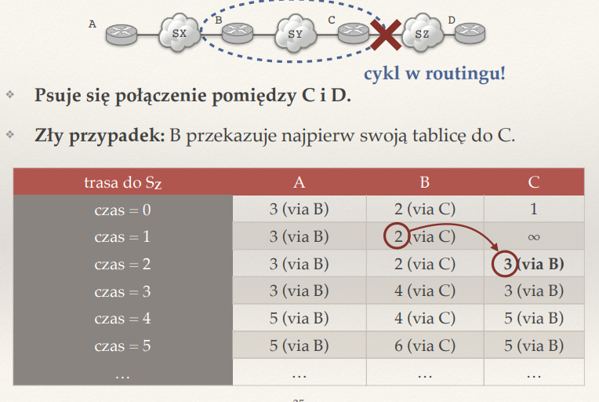

## Co to jest cykl w routingu? Co go powoduje?

Sytuacja, w której pakiet krąży w nieskończoność między routerami i nie dociera do miejsca docelowego. (router A wysyła do B, B do C, a C z powrotem do A). Cykle najczęściej są spowodowane nieprawidłowymi informacjami o trasach (np. doszło do jakiejś awarii i informacja z tablic routingu została źle ustawione), braku poison reverse, nie ustawieniu ttl pakietu,

## Czym różni się tablica routingu od tablicy przekazywania?

Tablica przekazywania - forwarding table
* ma informacje o następnym routerze na trasie
* podejmuje decyzje na podstawie najdłuższego prefiksu komu wysłać dany pakiet

Tablica routingu:
* ma informacje o trasach
* zawiera dodatkowe informacje np. o trasach zapasowych

## Dlaczego w algorytmach routingu dynamicznego obliczamy najkrótsze ścieżki?

Zapewnia nam to unikanie cykli (teoretyczne, był dowód na wykładzie) i prawidłowe konfigurowanie tablic przekazywania. Dodatkowo minimalizujemy koszty przesyłu danych.

## ??? Co to jest metryka? Jakie metryki mają sens?

metryka to wartość krawędzi w grafie, w którym chcemy minimalizować długość trasy

na wykładzie mówiliśmy o definiowaniu metryki względem:
* czasu propagacji
* kosztu pieniężnego
* ustawaniu najbliższym sąsiadom odl 1

## Czym różnią się algorytmy wektora odległości od algorytmów stanów łączy?

Algorytmy wektora odległości trzymają wektor V, w którym zapisane sa odleglosci do znanych mu routerow i sieci; informacje te sa propagowane tylko do sasiadow i na podstawie tego aktualizowana jest tablica routingu

W algorytmie stanów łączy natomiast 'zalewamy' wszystkie routery informacja o sasiedztwie innych routerow ktore nas otaczaja, a nastepnie lokalnie wyliczane sa najkrotsze sciezki (najczesciej Dijkstrą); musimy jednak zaimplementowac algorytm zatruwania sciezki oraz najepiej wysylac informacje E razem z adresem - s i numerem sekwencyjnym -n, aby informacje nie wracaly do osoby zalewajacej i nie tworzyly sie cykle

## ??? Jak router może stwierdzić, że bezpośrednio podłączona sieć jest nieosiągalna?

Jezeli nie otrzyma informacji o 'keepalive' od sasiada
jesli kabel zostal wypiety to tez automatycznie wiemy ze sasiad bedzie nieosiagalne

## Co to znaczy, że stan tablic routingu jest stabilny?

To znaczy, ze nie zmienial sie przez pewien czas i kazdy router ma ten sam obraz sieci, oraz stworzone tablice przekazywania beda bez cykli w routingu

## Jak zalewać sieć informacją? Co to są komunikaty LSA?

Najlepiej wysyłając informacje (E, s, n). informacje E razem z adresem - s i numerem sekwencyjnym -n, 
Mamy regule: (zalewa router X):
- jezeli otrzymales juz wiadomosc od adresu s o numerze sekwencyjnym n, to nic nie rob
- wpp wyslij ja do wszystkich sasiadow, poza X

LSA - Link state advertisement 
LSA zawiera zrodlo i numer sekwencyjny, jest wykoryztsywane w protokole OSPF, bo opisuje stan polaczen danego routera, co pozniej jest wykorzytywane do obliczania najkrotszych sciezek algorytmem dijkstry

## Co wchodzi w skład wektora odległości?

W sklad wektora odleglosci wchodzi lista(odleglosc, nazwa sieci), jakie dziela dany router od innej sieci/routera

## ??? W jaki sposób podczas działania algorytmu routingu dynamicznego może powstać cykl w routingu?

Jezeli informacja o nieskonczonosci zostanie pozniej rozpropagowana niz informacja innego routera o blednej juz odleglosci do celu. Generalnie w takich przypadkach jak awaria łącza lub rozpropagowanie informacji, która jest już przestarzała

## Co to jest problem zliczania do nieskończoności? Kiedy występuje?

Problem zliczania do nieskończoności: routery 'zapetlaja sie' i zwiekszaja co ture odleglosc o 1, mimo ze droga do celu zostala odcieta:
- Router A ma połączenie z siecią X i ogłasza do routera B trasę do X z odległością = 1.
- Gdy połączenie A ↔ X zostaje zerwane, A informuje B, że sieć X jest nieosiągalna.
- Ale zanim B odbierze tę informację, może jeszcze zdążyć ogłosić A, że „do sieci X prowadzi droga przez B” z odległością np. 2.
- A uwierzy B (bo protokoły wektora odległości nie mają pełnej wiedzy o topologii) i zacznie zwiększać odległość: 3, 4, 5...
- Proces trwa do osiągnięcia limitu metryki (np. w RIP limit = 16, co oznacza „nieskończoność”).

Wystepuje w protokolach opartych na wektorze odleglosci, po awariach lacza, gdy stosujemy poison reverse

## Na czym polega technika zatruwania ścieżki zwrotnej (poison reverse)?

Jezeli router A dowiaduje sie o trasie do sieci X od routera B, to A nigdy nie oglasza B, ze zna trase do X przez B; jezeli A musi wyslac komunikat, to 'zatruwa' trase do X w kierunku B, mowiac B, ze ta trasa przez A wynosi neiskonczonosc; dzieki temu B nie mysli, ze przez A istnieje lepsza trasa

## Po co w algorytmach wektora odległości definiuje się największą odległość w sieci (16 w protokole RIPv1)?

Zapobiega zliczaniu w nieskonczonosc w przypadku gdy dana siec stanie sie nieosiagalne

## Po co stosuje się przyspieszone uaktualnienia?

Po to, by natychmiast wysylac informachu o zmianie topologii sieci (np w przypadku awarii), a nie czekac na co 30 sekundowy interwal aktualizacji. Dzieki temu szybciej mozemy zaktualizowac tablice routingu

## ??? Co to jest system autonomiczny (AS)? Jakie znasz typy AS?

System autonomiczny to zbior sieci lub routerow ktore sa zarzadzane przez jedną organizacje lub dostawce (ISP - Internet service-producer)
Ma wspolna polityke routingu i zarzadza trasami wewnatrz AS oraz zewnetrznymi polaczeniami z innymi AS

Typy AS:
- brzegowy - dowiaduje sie o trasach do innych AS, rozglasza prefiksy CIDR tego ASa
- z jednym wyjsciem X - dodaje X na wszystkich routerach jako brame domyslna, ustala routing wewnatrz AS
- z wieloma wyjsciami X1, X2, ... - ma wiele polaczen z roznymi ASami, moze kierowac ruch przez rozne trasy

## Czym różnią się połączenia dostawca-klient pomiędzy systemami autonomicznymi od łącz partnerskich (peering)?

peering jest darmowy, lacza partnerskie platne
lacza partnerskie obsluguja caly internet, peering tylko do klientow AS i wlasnych

## Dlaczego w routingu pomiędzy systemami autonomicznymi nie stosuje się najkrótszych ścieżek?

Bo kieruja sie oplatami, nie chca udostepniac wewnetrznych szczegolow na temat AS, nie chca by dane byly przesylane przez ich AS i generowaly wiekszy ruch jesli nie maja z tego zysku; dlatego czasami moze sie okazac, ze bardziej oplacalna bedzie sciezka peeringowa, ktora niekoniecznie bedzie najkrotsza

## ??? Które trasy w BGP warto rozgłaszać i komu? A które wybierać?

- zawartosc naszego AS - czyli prefiksy CIDR
- trasy do naszych klientow - warto rozglaszac partnerom (za ten ruch nie placimy)
- trasy do dostawcow - warto rozglaszac klientom, ale nie partnerom, bo my placimy za ten ruch
- trase do naszych partnerow - rozglaszamy klientom, ale innym nie

## J??? ak BGP może współpracować z algorytmami routingu wewnątrz AS?

BGP - Border Gateway Protocol - odpowiada za wymianę informacji o trasach między różnymi AS.

Algorytmy routingu wewnetrznego - działają wewnątrz jednego AS, odpowiadając za wybór najlepszych ścieżek i rozgłaszanie tras między routerami w tym AS.

BGP zapewnia polaczenia zewnatrz, a ARW wewnatrz AS (dzieki temu BGP wie ktoremu routerowi wewnatrz AS przekazac informacje, nie dziala to w druga strone)