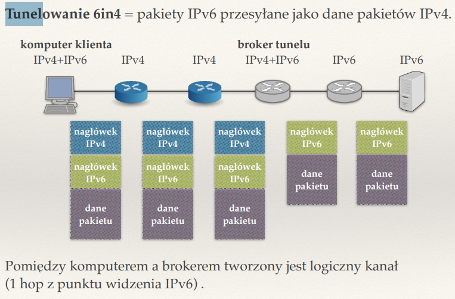
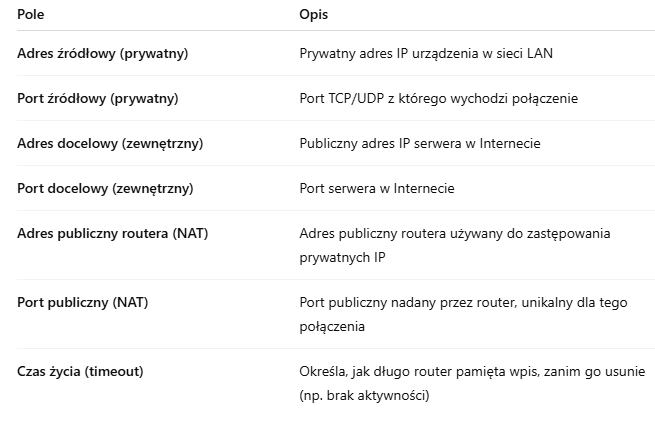

## ??? Co to są prywatne adresy IP? Jakie pule adresów są zarezerwowane na takie adresy?

Prywatne adresy to takie uzywane w sieciach lokalnych, ktore nie moga byc routowane w internecie. Generalnie po to mamy NAT wtedy by podmieniac taki adres na adres routera 

Zgodnie z dokumentem RFC 1918 wyróżniamy trzy pule prywatnych adresów IPv4:

10.0.0.0 – 10.255.255.255
(10.0.0.0/8, czyli maska podsieci 255.0.0.0)
To największy zakres, obejmujący 16 777 216 adresów.

172.16.0.0 – 172.31.255.255
(172.16.0.0/12, czyli maska podsieci 255.240.0.0)
Obejmuje 1 048 576 adresów.

192.168.0.0 – 192.168.255.255
(192.168.0.0/16, czyli maska podsieci 255.255.0.0)
Obejmuje 65 536 adresów.

## Co robi funkcja bind()?

Zajmuje sie wiazaniem portu i adresu Ip z gniazdem.
Bind dostaje numer gniazda, strukture adresowa i numer portu, z ktorym ma nastapic zwiazanie

## Czym różnią się porty o numerach mniejszych niż 1024 od innych?

Sa to porty uprzywilejowane, zarezerwowane pod uslugi systemowe i standardy protokolow; np:
80 - port HTTP
22 - SSH
ich uzycie wymaga uprawnien administartora

offtop:
1024-49151 - porty rejestrowane (przypisane do znanych uslug)
49152-65535 - porty dynamiczne (uzywane tymczasowo przez klienta)

##  ?? Jakie są zadania procesora routingu, portu wejściowego, portu wyjściowego i struktury przełączającej?

Procesor routingu to czesc sterujaca, zajmuje sie obsluga protokolow routingu (ospf, rip), utrzymuje i aktualizuje tablice routingu

Port wejsciowy - odbiera pakiet od interfejsu sieciowego i zglasza przerwanie

struktura przelaczajaca - zajmuje sie przenoszeniem pakietow miedzy portami

port wyjsciowy - wysyla pakiety do sieci docelowych

## ??? Czym się różni przełączanie pakietów w routerze za pomocą RAM od przełączania za pomocą struktury przełączającej?

ZA POMOCA RAM:
Pakiety przechodza przez port wejsciowy i trafiaja do procesora glownego, ktory na podstawie tablicy routingu i przechowywanego RAMu je analizuje. nastepnie CPU podejmuje decyzje na ktory port wyjsciowy przekazac pakiet i tam go daje

ZALETY:
proste w implementaji 
WADY:
wolne i nieskalowalne

ZA POMCOA STRUKTURY PRZELACZAJACEJ:
Pakiety przechodza przez port wejsciowy a nastepnie sa analizowane na pozioie sprzetowym a nastpnie przenoszone przez strukture przelaczajaca, ktora przenosi pakiety miedzy portami bez udzialu CPU

ZALETY:
szybkie i dobre dla duzych sieci
WADY:
drozsze w implementacji

## ?? Jakie są pożądane cechy struktury przełączającej w routerze?

- wysoka przepustowosc
- niska latencja (czyli malo opoznien)
- duza skalowalnosc
- odpornosc na bledy

## ?? Gdzie w routerze stosuje się buforowanie? Po co?

buforowanie jest wykorzystywane w portach wejsciowych i wyjsciowych

w portach wejsciwoych:
gdy przepustowosc struktury przelaczajacej jest za mala w celu magazynowania pakietow
problem blokowania przodu kolejki

w portach wyjsciowych:
zapobiegaja utracie pakietow przy czasowym zwiekszeniu liczby pakietow

## Po co w portach wyjściowych klasyfikuje się pakiety?

W celu ich szeregowania - wzgledem priorytetow strumieni lub szeregowane cyklicznie
Aby lepiej zarzadzac kolejkami, przeplywem pakietow i przeciazeniami

## Co to jest blokowanie początku kolejki? Gdzie występuje? Jak się go rozwiązuje?

Polega na tym ze pakiet ktory znajduje sie na poczatku kolejki nie moze zostac wyslany (np port wyjsciowy do ktorego ma trafic pakiet jest przepelniony). Wystepuje w portach wejsciowych. Rozwiazuje sie ten problem poprzez tworzenie wirtualnych kolejek pakietow - jedna kolejka dla kazdego portu wyjsciowego

## Rozwiń skrót LPM.

LPM = LONGEST PREFIX MATCH

## Jakie znasz struktury danych implementujące LPM? Porównaj je.

- tablica prefiksow - standardzik tablica routingu -> pamiec i lookup w O(n), insert/delete O(1)
- tablica haszujaca - wykorzystywane kiedys w standardach uniksowych, szczegolnie jak byly klasy ip; teraz tworzy sie 32 tablice najczesciej; pamiec O(n), lookup O(w) gdzie w dlugosc slowa; insert, delete O(1)
- drzewo trie - jak idziemy w lewo to dajemy 0, a jak w prawo to 1; kolory nam wskazuja istniejacy adres i port pod jaki ma zostac wyslany pakiet; pamiec O(n*w), lookup O(w) (chociaz w zasadzie umiemy w O(log(w), ale wtedy insert i delete w O(n))), insert, delete O(w)
- tcam - przechowuje pary (prefix, maska); dla adresu w rownolegle mozemy znalezc wszystkie pary, takie ze w & m = p & m, a nastepnie sprzetowo wybieramy najdluzszy z uzyskanych prefiksow; 

## Co to jest pamięć TCAM? Jak można ją zastosować do implementacji LPM?

TCAM - terary content adress memory - opisane wyzej

## Na czym polega fragmentacja IP? Gdzie się ją stosuje i dlaczego? Gdzie łączy się fragmenty?

Polega na podzieleniu pakietu IP na mniejsze czesci, ktore spelniaja wymagania MTU (maximum transition unit) na danej trasie pakietu.
Stsouje sie je w routerach wlasnie ze wzgledu na obowiazujace limity MTU (najczesciej ten limit wynosi 1500 bajtow). Fragmenty laczy juz odbiora pakietow na komputerze docelowym.

## Co to jest MTU? Na czym polega technika wykrywania wartości MTU dla ścieżki?

MTU czyli maximum transition limit

Technika wykrywania wartosci MTU dla sciezki polega na wyslaniu jednego pakietu o ustalonej wielkosci i zmniejszanie jego wielkosci z kazdym 'odbiciem' sie od jakiegos ograniczenia MTU na drodze. Czyli jej cel jest taki, by wykryc najmniejsza wartosc MTU na sciezce, by udalo sie wyslac wszytskie pakiety bez fragmentacji

## Jak działa szeregowanie pakietów w buforze wyjściowym routera?

Szeregowanie polega na przypisywaniu pakietu do strumienia - na podstawie jego adresu i portu zdrowego oraz docelowego

Sa dwa sposoby szreegowania:
- cykliczne - jeden pakiet z kazdego strumienia jest wysylany (petla)
- priorytetowe - na poczatku sa wysylane pakiety o najwyzszym priorytecie

## Jakie są różnice pomiędzy nagłówkami IPv4 i IPv6?

IPv6 - adres zdrolowy 128 bitowe - notacja to 8 blokow po 4 cyfry szesnastkowe, rozdzielone dwukropkiem i liczby szesnastkowe, moga wystepowac skrocenia adresow
brak sumy kontrolnej, fragmentacji, wystepuje etykieta strumienia; brak adresu rozgloszeniowego

IPv4 - adres zrodlowy 32 bitow - notacja to 4 liczby w systemie dziesietnym z przedzialu 0-255 odzielone kropka, ma adres rozgloszeniowy i sieciowy

## Zapisz adres IPv6 0321:0000:0000:0123:0000:0000:0000:0001 w najkrótszej możliwej postaci.

321:0:0:123::1

## Co to jest tunelowanie 6in4?

To technika ktora pozwala wysylac pakiety IPv6 przez infrastrukture sieci dzialajaca w IPv4

## Na czym polega NAT i po co się go stosuje? Jakie są jego zalety i wady?

NAT = Network Adress Translation
Technika ktora jest stosowana w routerach, ktora tlumaczy prywatne adresy IP w sieci lokalnej LAN, na publiczy adres IP uzywany w internecie; 
jest to spowodowane tym, ze publiczne adresy IPv4 sa ograniczone

Jak dziala? 
Gdy komputer z LAN chce wyslac pakiet do Internetu to router:
1. zmienia adres zdrodlowy tego komputeraz z prywatnego na publiczny i zapamietuje to mapowanie
2. gdy odpowiedz wraca z internetu to router sprawdza mapowanie i przekazuje odp do odpowiedniego komputera

ZALETY:
- oszczedzamy publiczne adresy IP
- jestesmy w pewien sposob izolowani i bardziej bezpieczni (pozornie)
- ulatwia zmiane dostawcy interntu - zmienia sie tylko adres puliczny, prywatne pozostaja
- z internetu rownoczesnie moze korzystac wiele urzadzen

WADY:
- utrudnia nawiazanie polaczen przychodacych

## Jaki stan musi przechowywać router z funkcją NAT?

stan mapowania polaczenia 
