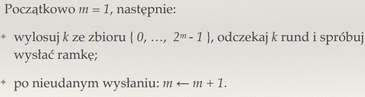
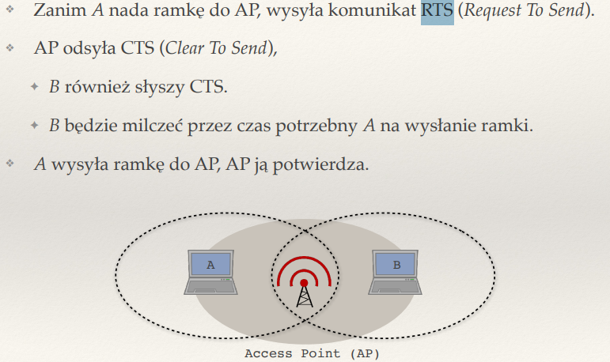

## Jakie są zadania warstwy łącza danych a jakie warstwy fizycznej?

Warstwa łącza danych:
- umozliwia komunikacje miedzy dwoma sasiadujacymi urzadzeniami
- zawodna usluga wysylania ramek
- musi sobie radzic z bledami transmmisji

Warstwa fizyczna:
- okresla szczegoly przesylania pojedynczych bitow

## Czym różni się koncentrator od przełącznika sieciowego?

Koncentrator:
- przesyla dane do wszystkich portow
- moze powodowac kolizje danych
- wszystkie urzadzenia podlaczone do jedngeo koncentratora dziela jedno pasmo
- 'glupi' - nie uczy sie adresow mac

Przelacznik:
- przesyla dane tylko do odpowiedniego  portu
- uczy sie adreesow MAC podlaczonych urzadzen i zapisuje je w swojej tabllicy
- redukuje kolizje danych
- umozliwa rownoczesna komunikacje miedzy wieloma urzadzeniami

## Jak działa algorytm rundowy i bezrundowy ALOHA?

Rundowy ALOHA:
- czas podzielony na rundy
- dlugosc rundy wystarcza do nadania jednej ramki
- jesli komputer ma ramke do wyslania nadaje ja z ppb p
- dla p = 1/ n gdzie n to liczba komputerow ktore chca wyslac ramke, sukces co 2.71 raza (e)

Bezrundowy ALOHA:
- brak globalnego zegara - kazdy komputer ma swoje rundy
- przy p = 1/n wykorzystanie lacza dwukrotnie nizsze (1/2e)
- wciaz musimy znac n by wybrac optymalne p

## Jak działa algorytm odczekiwania wykładniczego?

- brak globalnego zegara
- zmniejszamy ppb wyslania ramki z kazdym nieudanym wyslaniem

## Wyjaśnij skróty CSMA/CD i CSMA/CA.

CSMA/CD - Carrier Sense Multiple Access with Collision Detection (jesli wykryjemy kolizje, natychmiast konczymy wysylanie ramki, uzywane w ethernecie)

CSMA/CA - Carrier Sense Multiple Access with Collision Avoidance (brak wykyrywania kolizji, ramka zawsze nadawana do konca, uzywane w Wifi)

## Opisz budowę ramki Ethernetowej.

Ramka ethernetowa sklada sie z:
- adresu docelowego MAC
- adresu zrodlowego MAC
- typu
- danych (od 46 do 1500 bajtow)
- sumy kontrolnej crc

## Co to jest adres MAC?

Jest to adres karty sieciowej; sklada sie z 6-bajtowego unikatowego ciagu
Pierwsze trzy bajty identyfikuja producenta sprzetu, ostatnie 3 to indywidualny numer nadany przez producenta

## Do czego służy tryb nasłuchu (promiscuous mode)?

Tryb nasluchu w kartach sieciowych polega na przekazywaniu do systemu wszystkich widzianych ramek (tak jak to robi Wireshark), a nie tylko tych skierowancyh do tej konkretnej karty sieciowej. Dzieki temu mozemy analizowac ruch sieciowy.

## Po co w Ethernecie definiuje się minimalną długość ramki?

Jest to zwiazane z mozliwym wykrywaniem kolizji . Minimalna dlugosc ramki gwarantuje, ze transmisja bedzie trwac wystarczajaco dlugo by umozliwic wykrycie kolizji i ponowna transmisje pakietu. Minimalna dlugosc ramki: 64 bajty, z czego czesc moze stanowic padding 
Wspiera mechanizm wykrywania kolizji CSMA/CD (Carrier Sense Multiple Acces with Colision Detection)

## Do czego służą protokoły ARP i DHCP?

ARP - Address Resolution Protocol
Jego zadaniem jest ustalenie jaki adres MAC odpowiada znanemu adresowi IP

Kiedy urządzenie w sieci (np. komputer) chce wysłać pakiet do innego urządzenia w tej samej sieci lokalnej (LAN), zna adres IP odbiorcy.

Musi jednak poznać adres MAC odbiorcy, aby wysłać ramkę Ethernet.

Wysyła zapytanie ARP (broadcast) do całej sieci z pytaniem: "Kto ma adres IP X.X.X.X?".

Właściciel tego IP odpowiada, podając swój adres MAC.

Adres MAC jest zapamiętywany w tabeli ARP urządzenia.

ARP dziala w warstwie lacza danych 

DHCP - Dynamic Host Configuration Protocol
Jego zadaniem jest automatyczne przydzielenie adresow IP urzadzeniom w sieci

DHCP dziala w warstwie aplikacji

## ??? Czym różni się łączenie dwóch sieci za pomocą mostu od łączenia ich za pomocą routera?

Most to przelacznik z dwoma portami
Mostem najczesciej laczymy dwie rozne technologie - Ethernet i Wifi 

🔹 Łączy dwie segmenty tej samej sieci LAN (np. dwa podsieci Ethernet), tworząc jedną większą sieć.
🔹 Przepuszcza ramki między segmentami na podstawie adresów MAC (filtrowanie ruchu).
🔹 Nie zmienia adresów IP, działa przezroczysto dla warstwy sieciowej.
🔹 Umożliwia redukcję ruchu w sieci (most filtruje ruch lokalny).

Router
🔹 Łączy dwie różne sieci IP (np. 192.168.1.0/24 i 192.168.2.0/24).
🔹 Przekazuje pakiety IP między różnymi sieciami (routing).
🔹 Zmienia nagłówki pakietów, np. aktualizuje adres docelowy lub przeznaczenie na nowy interfejs.
🔹 Może pełnić dodatkowe funkcje: NAT (tłumaczenie adresów), firewall, QoS.

## ??? Jak warstwa łącza danych realizuje rozgłaszanie?

jeśli adres odbiorcy = FF:FF:FF:FF:FF:FF, to
ramkę interpretują wszyscy.

## Na czym polega tryb uczenia się w przełączniku sieciowym?

Uczenia sie adresow MAC i kojarzenia ich i budowania tabel adresow MAC. Dzieki czemu przelacznik wie ktore urzadzenie (adres MAC) znajduje sie na jakim porcie i moze kierowac ruch tylko do tego odpowiedniego portu

## Po co w przełączanym Ethernecie stosuje się algorytm drzewa spinającego?

STP - Spanning Tree Protocol

STP analizuje topologie sieci i wybiera najlepsze sciezki, a pozostale blokuje, by unikac petli; w przypadku awarii sieci automatycznie sa odblokowywane alternatywne sciezki

Czyli glownie wykorzystujemy go po to by:
- unikac petli w sieci przelaczanej ethernet
- zapewniac stabilnosc i redundancje (blokujac nadmiarowe sciezki)

## ?? Co to jest sieć VLAN? Po co się ją stosuje?

VLAN - wirtualna siec lokalna
🔸 Przełączniki (switches) obsługujące VLAN-y przypisują porty do konkretnych VLAN-ów.
🔸 Ramki Ethernet są tagowane (np. standard IEEE 802.1Q) – dodaje się identyfikator VLAN (VID), aby rozróżnić ruch należący do różnych VLAN-ów.
🔸 Router lub przełącznik warstwy 3 obsługuje komunikację między VLAN-ami (tzw. routing między VLAN-ami).

📚 Po co się stosuje VLAN-y?
✅ Segregacja ruchu – pozwala podzielić jedną fizyczną infrastrukturę na kilka odseparowanych sieci logicznych.
✅ Bezpieczeństwo – oddziela ruch np. działu finansowego od gości Wi-Fi, minimalizując ryzyko podsłuchu.
✅ Oszczędność sprzętu – zamiast budować oddzielne sieci fizyczne dla każdego działu, stosuje się VLAN-y.
✅ Kontrola dostępu i zarządzanie ruchem – np. QoS (Quality of Service) może być ustawiane na poziomie VLAN-ów.
✅ Skalowalność i elastyczność – łatwo zmieniać przypisanie portów do VLAN-ów bez zmiany okablowania.

## Wyjaśnij zjawisko ukrytej stacji

Przez to ze w sieciach wifi nie jest wykorzystywane CSMA/CD, kolizja jest nie do wykrycia
Rozwiązaniem jest RTS/CTS, który rezerwuje medium przed transmisją.

## Na czym polega rezerwowanie łącza za pomocą RTS i CTS?

RTS - request to send

CTS - Clear to send
Stosowane sa w sieciach Wifi w ramach CSMA/Ca

Zalety RTS/CTS

- redukuje ryzyko kolizji w sieciach ukrytych
- zmniejsza straty pakietow i poprawia efektywnosc transmisji
