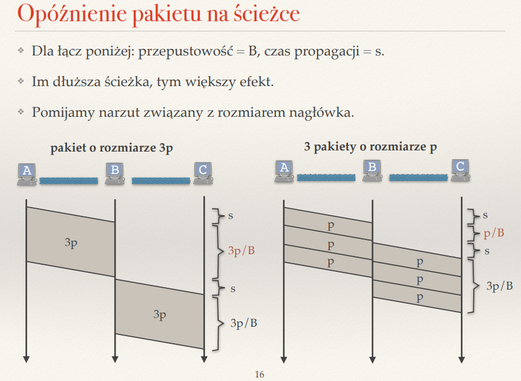

## Co może stać się z przesyłanym ciągiem pakietów IP podczas zawodnego i niezawodnego transportu?

Zawodny transport - UDP:
- zgubienie pakietu
- dotarcie w innej kolejnosci
- duplikacja
- brak poptwierdzen
- brak retransmijsji

Niezawodny transport - TCP:
- gwarantowane dostarczenie
- wysylanie ACK
- korekta kolejnosci
- wykrywanie utraconych pakietow i ich retransmisja

## Co to jest kontrola przepływu?

Dostosowywanie przez nadawce predkosci transmisji do szybkosci odbiorcy

## Czym różnią się protokoły UDP i TCP? Podaj zastosowania każdego z nich.

roznice w pierwszym pytaniu
Zastosowania:
UDP:
- gry online
- male ilosci danych (DNS, DHCP)
- pelna kontrola nad przesylanymi danymi(NFS)
- proste,  ograniczone obliczeniowo urzadzenia

TCP:
- duze ilosci danych (HTTPS)
- nieinteraktywny streaming
- bankowosc

## Co to jest segmentacja? Dlaczego segmenty mają ograniczoną wielkość? Rozwiń skrót MSS.

segmentacja jest wykorzystywana w niezwodnym transporcie, polega na podziale bajtow na mniejsze jednostki zwane wlasnie segmentami.
Segmenty maja ograniczona wielkosc ze wzgledu na ograniczenia warstwy sieciowej -> MTU, plus wielkosc naglowka IP, plus wielkosc naglowka TCP
Zatem MSS - Maximum Segment Size jest rowny:
MSS = MTU - rozmiar naglowka IP - rozmiar naglowka TCP
MSS wynosi okolo 1460 bajtow

## Jak nazywają się jednostki danych przesyłane w kolejnych warstwach?
 
warstwa transportowa - UDP - datagramy
warstwa transportowa - TCP - segmenty
warstwa lacza danych - ramki
warstwa sieciowa - pakiety

## Jak małe pakiety zmniejszają opóźnienie przesyłania danych?

- male pakiety sa szybciej przesylane przez lacze
- szybciej sa przetwarzane przez routery
- chyba chodzi o to:

## Wytłumacz znaczenie skrótów RTT i RTO. Na jakiej podstawie ustalana jest wartość RTO?

RTT - Round Trip Time
RTO - Retransmission Timeout 

RTO = 2 * avg-RTT = 4 * var-RTT

avg-RTT = alpga * avg-RTT + (1 - alpha) * zmierzone-RTT
podobnie var-RTT tylko ze wariancja

## Jak protokoły niezawodnego transportu wykrywają duplikaty pakietów i potwierdzeń?

kazdy pakiet i potwierdzenie ma nadany numer sekwencyjny, jezeli otrzymalismy juz pakiet/potwierdzenie o tym numerze, to znaczy ze uzyskalismy duplikat
W przypadku potwierdzenia otrzymania, otrzymujemy w ACK do ktorego bajtu uzyskalismy potwierdzenie
Jezeli dane ACK pojawia sie wieokrotnie -> znaczy ze trzeba wykonac retransmisje

## Opisz algorytm Stop-and-Wait. Jakie są jego wady i zalety?

Stop and wait -> wyyslamy pakiet i czekamy na jego potwierdzenie. Dopiero wowczas mozemy wyslac kolejny pakiet. Kazdy pakiet jest numerowany i kazde potwierdzenie tez. stad wiemy ktore pakiety doszly;

ZALETY:
- zapewnia gwarancje przeslania wszystkich pakietow
- dobre dla wolnych i niestabilnych laczy
WADY:
- wolny
- slabe wykorzystanie lacza
- nieefektywne przy duzych danych

## Do czego służą numery sekwencyjne w niezawodnym protokole transportowym?

Ulatwiaja spradzanie duplikacji pakietow lub ich ewentualnego braku -> ACK tez potwierdza nam do ktorego bajta wyslalismy dane, mozemy poprpsoic o ewentualna retransmisje; nie potwierdzimy tez przez przypadek inego pakietu. pozwalaja tez zachowac prawidlowa kolejnosc danych 

## Opisz algorytm okna przesuwnego

Mamy okno w ktorym pierwszym pakiet nie jest jeszcze potwierdzony; w tej metodzie mozemy wysylac wiele pakietow na raz i  w momencie jak pakiety uzyskuja potwierdzenie, to przesuwamy okno;

Nadawca może wysłać jednocześnie kilka pakietów mieszczących się w "oknie".

Odbiorca potwierdza (ACK) te pakiety, które zostały poprawnie odebrane.

Po odebraniu ACK, okno się przesuwa – nadawca może wysłać kolejne dane.

Dodatkowo nadawca moze zmniejszac/zwiekszac rozmiar okna w zaleznosci od mozliwosci odbiorcy

mamy kilka rodzajow akceptowania pakietow:
- selktywne
- go back-n
- skumulowane

## Jaki jest związek między rozmiarem okna a BDP (bandwidth-delay product)?

BDP = przepustowosc * opoznienie 
BDP to maksymalna liczba bajtow jakie moga byc jednoczesnie przesylane

rozmiar okna to liczba bajtow jakie nadawca moze wyslac bez czekania na potwierdzenie

zatem aby w pelni wykorzystac dostepna przepustowosc:
rozmiar okna = BDP -> albo nawet >, w kazym razie wtedy w 100% wykorzystujemy przepustowosc

## Opisz i porównaj następujące mechanizmy potwierdzania: Go-Back-N, potwierdzanie selektywne, potwierdzanie skumulowane.

goback n to potwierdzanie pojedyncze;
selektywne potwierdza kazdy pakiet i zapisuje je w buforze, przesuwa okno jak pierwszy pakiet z okna (i byc moze kolejne) sa potwierdzone
skumulowane - mowi do  ktorego pakietu mam wszystko, dzieki temu wiemy ktore pakiety trzeba retransmitowac

## ?? Dlaczego istotne jest potwierdzanie odbioru duplikatów segmentów?
By rozrozniac duplikaty od inncyh wyslanych danych 
Jeśli odbiorca otrzyma ten sam segment wiele razy, wysyła kolejne ACK-i z tym samym numerem. Nadawca, po otrzymaniu np. trzech identycznych ACK-ów, uruchamia szybką retransmisję brakującego segmentu
By utrzymac ciaglosc retransmisji

## Co to jest okno oferowane? Jak pomaga w kontroli przepływu?

okno oferowane to wolne miejsce w buforze; nadawca dostowuje rozmiar tego okna to mozliwosci odbioru pakietow przez odbiorce (bo okno oferowane jest przez ODBIORCE, nadawca sie do niego dostosowuje i tak wysyla)

## Jakie mechanizmy niezawodnego transportu i kontroli przepływu implementowane są w protokole TCP?

transport
- numeracja sekwencyjna
- potwierdzanie ACK
- retransmisje
- wykrywanie duplikatow
przepplyw
- okno oferowane
- okno przesuwne

## Na czym polega opóźnione wysyłanie ACK w protokole TCP?

technika majaca na cclu zmniejszenie wysylanych potwierdzen; w tym ustalonym czasie moze dojsc do nas kolejny pakiet i potwierdzimy je wtedy razem, dzieki temu lepiej wykorzystujemy pasmo, mniej obciazamy procesor, wysylamy mniiej ACK

## Na czym polega mechanizm Nagle'a? Kiedy nie należy go stosować?

Mehcnizm ten dziala, gdy wysylamy dane mniejsze od MSS, tCP wowczas nie wysyla ich od razu tylklo czeka na kolejna porcje 
Jeśli aplikacja wysyła małe porcje danych (np. pojedyncze bajty), TCP nie wysyła ich od razu.

Zamiast tego, jeśli jest niepotwierdzony segment w locie (czyli wysłany, ale jeszcze niepotwierdzony przez odbiorcę), mechanizm buforuje kolejne małe dane.

Dopiero gdy nadejdzie potwierdzenie (ACK) poprzedniego segmentu, TCP może wysłać następny segment.

W efekcie pakiety są grupowane w większe segmenty, co zmniejsza narzut i obciążenie sieci.

Nie nalezy go stosowac przy programach interaktywnych

## Co oznaczają pola ,,numer sekwencyjny'' i ,,numer potwierdzenia'' w nagłówku TCP?

numer sekwenycjny = numer pierwszego bajtu danych przesylanego w  pakiecie tcp

numer potwierdzenia = numer nastepnego oczekiwanego bajtu w ACK

## Czy warstwa transportowa implementowana jest na routerach? Dlaczego?

nie, nie chcemy tego laczyc, tylko by kazda warstwa dzialala odrebnie, router zajmuje sie przekazywaniem pakietow, zatem on potrzebuje tylko watswy lacza danych i warstwy sieciowej

## Sformułuj słabą i silną zasadę end-to-end

Slaba wersja:
niezwodne przesylanie MUSI byc zaimplementowane na urzadzeniach koncoywchm ale warstwy nizsze MOGA w tym pomagac

Silna wersja: 
Niezawodne przesylanie MUSi byc zaimplementowane na urzadzeniach koncowych, warstwy nizsze NIE POWINNY sie tym zajmowac