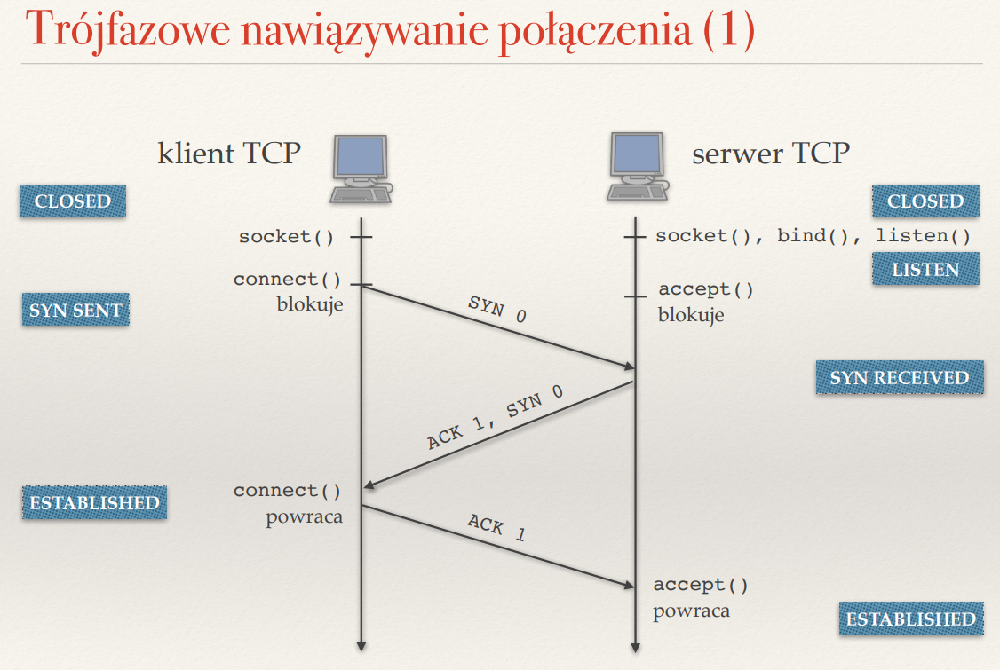
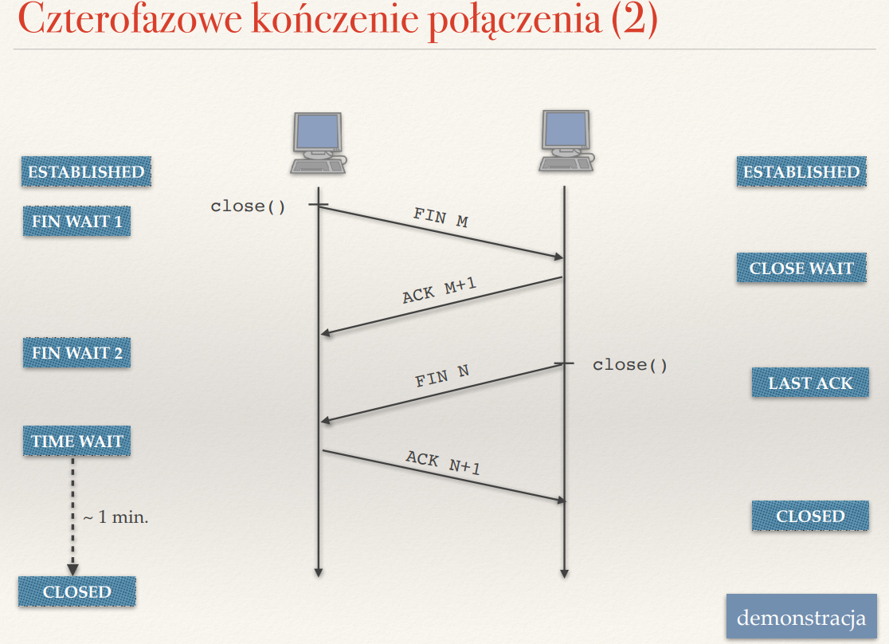
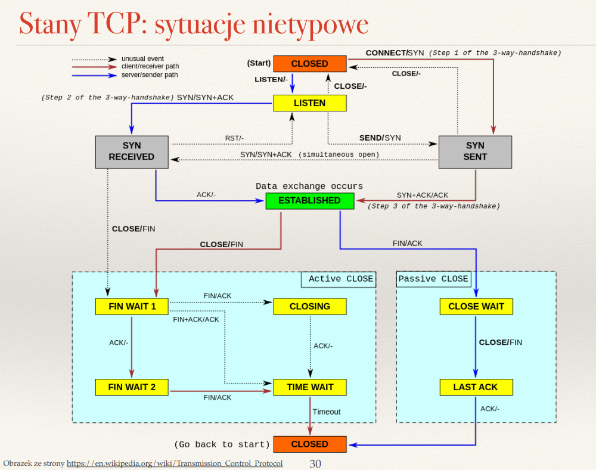

## Co to jest gniazdo?

Gniazdo to polaczenie adresu ip, numeru portu oraz protokolu (UDP, TCP) ktore sluzy do komunikacji miedzy komputerami.

## Czym różni się gniazdo nasłuchujące od gniazda połączonego? Czy w protokole UDP mamy gniazda połączone?

Gniazdo nasluchujace powstaje jako pierwsze, kiedy utworzymy gniazdo funkcją bind() dla serwera by nawiazywal polaczenia .

Gniazdo polaczone natomiast powstaje dopiero po polaczeniu klienta i serwera

W UDP nie mamy gniazd polaczonych

## Co robią funkcję jądra bind(), listen(), accept(), connect()?

bind() tworzy gniazdo, zwiazuje adres ip z portem

listen() sluzy do kolejkowania polaczen ale ich nie obsluguje; przeksztalca gniazdo w gniazdo nasluchujace

accept() bierze z koljeki polaczenie; tworzy gniazdo polaczone

connect() nawiazuje polaczenie z serwerem, uzywane przez klienta

## Czym różni się komunikacja bezpołączeniowa od połączeniowej?

bezpolaczeniowa -> stara poczta
- nie mamy mechanizmu nawiazujacego polaczenie i pozniejszego szybkie wysylania

polaczeniowa -> rozmowa telefoniczna

na poczatku komunikaty nawiazujace polaczenie, rozmowa, pozniej zakonczeniu polaczenia

## Czym różni się otwarcie bierne od otwarcia aktywnego? Czy serwer może wykonać otwarcie aktywne?

otwarcie bierne wykonywane przez serwer w postaci utworzenia gniazzda w celu przyjmowania polaczen

Wywołuje kolejno:

socket() – tworzy gniazdo,

bind() – przypisuje IP i port,

listen() – przechodzi w tryb nasłuchiwania (passive),

accept() – czeka na połączenie (blokująco).

otwarcie aktywne wykonuje klient w poprzez chec polazcenia z serwerem

Wykonuje:

socket()

connect() -> rozpoczyna tzw. 3-way handshake TCP.

W typowej architekturze serwer nie powinien wykonywac otwarcia aktywengo.

## Do czego służą flagi SYN, ACK, FIN i RST stosowane w protokole TCP?

SYN - synchronize do nawiazania polaczenia. Przesyłany w pierwszym kroku tzw. 3-way handshake

ACK - akcept do potwierdzenia

FIN - finish do konczenia polaczenia. Całe zamknięcie to 4-segmentowe zamykanie TCP

RST - reset, gdy wystapi blad, dochodzi do natychmiastowego zakonczenia, psuje gniazdo od razu

## Opisz trójstopniowe nawiązywanie połączenia w TCP. Jakie informacje są przesyłane w trakcie takiego połączenia?

Najpierw my musimy socket() - utworzyc gniazdo, a serwer musi zrobic socket(), bind() i listen(). wtedy przechodzi w stan LISTEN
wysylamy SYN, serwer odpowiada ACK i wysyla swoje SYN - wtedy mamy stan ESTABLISHED, a my ACK na jego SYN i wtedy serwer tez ma stan ESTABLISHED

## ??? Dlaczego przesyłanych bajtów nie numeruje się od zera?

-> w tcp uzywamy losowego numeru sekwencyjnego 
- bezpieczenstwo -> w probach ataku typu spooofing 
- izolacja niezaleznych polaczen - jezeli mamy polaczenie miedzy A i B i powstalo by kolejne polaczenie w tym samym czasi mogloby dojsc do przypisaniu blednych danych polaczeniom

## Jakie segmenty są wymieniane podczas zamykania połączenia w protokole TCP?

FIN, ACK 

## Co zwraca funkcja recv() wywołana na gnieździe w blokującym i nieblokującym trybie?

- tryb blokujacy: Czeka (blokuje program), dopóki nie przyjdą jakieś dane albo połączenie nie zostanie zamknięte.
Zwraca:

Dane jako ciąg bajtów, jeśli coś przyszło,

0 bajtów, jeśli druga strona zamknęła połączenie (FIN w TCP),

-1 lub wyjątek, jeśli wystąpił błąd (np. połączenie przerwane).

- tryb nieblokujacy: Nie czeka na dane – od razu zwraca kontrolę do programu.

Zwraca:

Dane, jeśli są dostępne,

-1 i errno == EWOULDBLOCK lub EAGAIN, jeśli żadne dane nie są dostępne w tej chwili.

## Po co wprowadzono stan TIME_WAIT?

- zeby odczekac gdyby ewentualny akcept nie dotarl (wtedy wysylamy fina jeszcze raz)
-  by nie utworzylo sie gniazdo  ztakimi samymi parametrami jak to co sie teraz zamyka

## ??? Na podstawie diagramu stanów TCP opisz możliwe scenariusze nawiązywania i kończenia połączenia.

