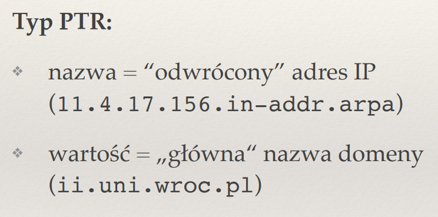
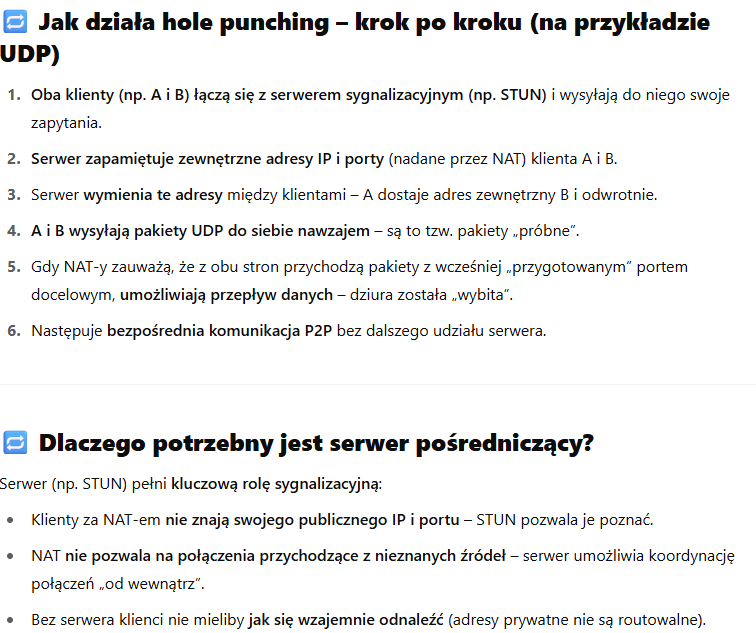

## Jaki jest cel systemu nazw DNS?

DNS - DOmain Name System;
CELE:
- Tlumaczy adresy domenowe na adresy ip (latwiej nam jest zapamietac nazwe niz cyferki z adresu ip), komputery i sieci rozumieja tylko adresy ip
- obsluguje duza liczbe rekordow
- odporny na bledy pojedynczych serwrow
- rozproszone zarzadzanie

## Do czego służy plik /etc/hosts?

przechowuje lokalnie odwzorowanie nazw domen na adresy IP

## Rozwiń skrót TLD (kontekst: DNS), podaj parę przykładów

TLD - Top Level Domains

PrzykladY:
pl, com , uk

## Czym są strefy i delegacje DNS?

Strefy to fragmenty przestr\eni nazw dns zarzadzane przez konkretny serwer dns

Delegacje to proces podczas ktorego przekazuje sie odpowiddzialnosc za czesc przestreni nazw innemu serweroni dns

## Czym różni się rekurencyjne odpytywanie serwerów DNS od iteracyjnego?

W iteracyjnym to my musimy odpytywac kolejne serwery nazw o adresy IP zaczynajac od korzenia
W rekurencyjny resolver DNS robi za nas odpytywanie i zwraca odp

##  Jak działa odwrotny DNS? Jaki typ rekordów i jaką domenę wykorzystuje?

Odwortny czyli tlumaczy adresy IP na nazwe domeny
WYkorzystuje typ PTR czyli Pointer Record, nazwa to odwrocony adres ip\

wykorzystuje domene ipv4:
- Adres IP zapisuje się odwrotnie, z dodanym sufiksem .in-addr.arpa.

PRZYKLAD:
IP: 192.0.2.25

Domenowa forma do sprawdzenia: 25.2.0.192.in-addr.arpa

DNS sprawdza rekord PTR dla tej domeny → np. host.example.com.

wykorzystuje domene ipv6:
- Adresy IPv6 są zapisywane jako odwrócone czwórki heksadecymalne z sufiksem .ip6.arpa.

## Jakie znasz typy rekordów DNS? Co to jest rekord CNAME?

- typ CNAME - canonical name
nazwa = alias domeny
wartosc = glowna nazwa domeny

- typ MX - mail exchanger
nazwa = nazwa domenty
wartosc = nazwa serwera obslugujacego poczte

- typ PTR - Pointer Record
nazwa = odwrocony adres IP ( z .in-addr-arpa)
wartosc = glowna nazwa domeny

## Do czego służy protokół SMTP a do czego IMAP?

SMTP = simple mail transfer protocol - do wysylania poczty elektronicznej
IMAp  = Internet message access protocol -sluzy do odbierania i zarzadzania wiadomosciami email na serwerze

## Co to są przekaźniki SMTP (relays)? 

To serwery pocztowe ktore przyjmuja email i przekazuja do dalej w drodze do odbiorcy

Skalowanie: Duże systemy pocztowe korzystają z wielu przekaźników, aby obsłużyć ogromną liczbę wiadomości.

Bezpieczeństwo: Można stosować filtrowanie antyspamowe, uwierzytelnianie, logowanie.

Ograniczenia dostępu: Tylko autoryzowani użytkownicy mogą wysyłać wiadomości.

Metoda wyyslania posredniego

## ?? Jaki rekord DNS jest sprawdzany przed wysłaniem poczty do danej domeny?

rekord MX

## Wymień parę popularnych pól w nagłówku maila. Do czego służą pola Received i Bcc?

From, to , subject, date, content-type

received - 	Ślad przeskoku wiadomości przez serwery po drodze (relay logs), Tworzone automatycznie przez każdy serwer SMTP

BCC - blind carbon copy - ukryta kopia dla odbiorcow 

## Co umożliwia standard MIME?

okreslenie typu wysylanych danych co ulatwia ich pozniejszy odczyt
text/plain
image/jpg
application/octet-stream

## Co to jest spam? Jakie znasz metody walki ze spamem?

Spam t oniechciane wiadomosci wysylane masowo be zgody odbiorcy

Rodzaje walki:
- greylisting - opoznianie wysylania wiadomosci
- SPF (Sender POlicy Framework) -> ze z naszej domeny uni wroc pl mozemy otrzymywac maile tylko z tej domeny
- uczenie masynowe
- metody statystyczne

## Na czym polega mechanizm SPF?

POlega na dodaniu odpowiedniego rekordu w DNSie ktory okresla dla danej domeny jakie adresy IP i rozszerzenia moga wysylac maile

## Jaka jest rola trackera w sieci Bittorrent?

- Pozwala na pierwszorazowe polaczenie komputera z siecia
- przechowuje 50 -100 adresow ip komputerow nalezacych do sieci
- Łączy peerów ze sobą
- Zarządza dostępnością

Co tracker nie robi:
- Nie zawiera żadnych danych o plikach.

- Nie przesyła plików – robią to sami użytkownicy między sobą.

- Nie decyduje o zawartości torrenta (pliku .torrent).

## Po co w plikach .torrent stosuje się funkcje skrótu?
zeby sprawdzic czy pobralismy odpowiedni fragment

## Jakie są różnice w postępowaniu seedera i leechera w sieci BitTorrent?

seeder - altruista - ma wszystkie kawalki tworzy liste klientow ktore chca je pozyskac

Leacher - ma tylko niektore kawalki; twrorzy sobie liste klientow P ktorzy odsylaja mu kawalki najszybciej:
- wysya tylko jesli ktos odesle mu cos wzamian
- lista P osob ktore wysylaja nasjszybciej 
- czasami losowej osobie by zobaczyc czy ona nie bedzie wysylala szybciej
- nowym klientom - zawsze za darmo

## Na czym polegają połączenia odwrócone? Jak stosuje się je w protokole FTP?

Polaczenia odwrocone czyli serwer inicjuje polaczenie z klientem. 
W protokole FTP dodaje sie tryb pasywny:
Klient łączy się z serwerem na port 21 (tak samo).

Serwer mówi: "Otworzyłem port Y – połącz się ze mną tam".

Klient sam łączy się do serwera na port Y – nie ma połączenia odwróconego.
Tryb pasywny jest łatwiejszy w konfiguracji za NAT-em/firewallem i dziś jest znacznie częściej używany.

## ?? Opisz podobieństwa i różnice asymetrycznych (cone) NAT (pełnego i ograniczonego) i symetrycznych NAT.

- wszystkie pakiety - pelny asyemtryczny NAt
- pakiety tylk odo ip z listy - ograniczony asyetryczny nat
- tylko pakiety od par (ip, port) z listy (ograniczony portowo asymetrczny NAT), dziala wybijanie dziur
- Pb zalezy od adresu, portu nadawcy i portu odbiorcy, wybijanie dziur nie dziala, pomagaja tylko przeakazniki

## ?? Opisz technikę wybijania dziur (hole punching) w NAT. Po co konieczny jest serwer pośredniczący?

technika umożliwiająca ustanowienie bezpośredniego połączenia pomiędzy dwoma urządzeniami znajdującymi się za NAT-em

